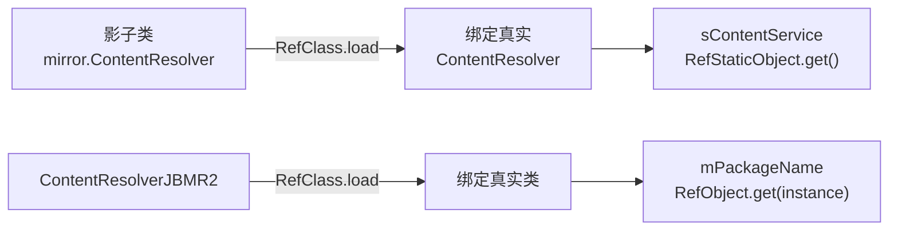

# mirror · ContentResolver

::: tip 源码路径
[`src/main/java/mirror/android/content/ContentResolver.java`](https://github.com/android-security-engineer/VirtualXposed-skills/blob/vxp/VirtualApp/lib/src/main/java/mirror/android/content/ContentResolver.java)
:::

镜像真实类 `android.content.ContentResolver`。主类放静态字段，JBMR2 子类放 API 18+ 新增的实例字段。

## 主类 ContentResolver（静态字段）

从源码提取：

| 成员 | 类型 | 说明 |
| --- | --- | --- |
| `TYPE` | Class | `RefClass.load(ContentResolver.class, android.content.ContentResolver.class)` |
| `sContentService` | RefStaticObject&lt;IInterface&gt; | 静态字段，ContentResolver 持有的全局 ContentService |

## 版本子类 ContentResolverJBMR2（API 18+）

| 成员 | 类型 | 说明 |
| --- | --- | --- |
| `Class` | Class | `RefClass.load(ContentResolverJBMR2.class, ContentResolver.class)` |
| `mPackageName` | RefObject&lt;String&gt; | 实例字段，JBMR2 新增的 mPackageName |

`mPackageName` 是 API 18 引入的实例字段——ContentResolver 在 JBMR2 后记录所属包名，VirtualXposed 用它改写虚拟 App 的 ContentResolver 包名。

## 镜像绑定与访问

静态字段用 `RefStaticObject`（无需实例），实例字段用 `RefObject`（需传实例）。

## 真实类与使用方

镜像的真实类为 `android.content.ContentResolver`。`mPackageName`（JBMR2）被以下模块引用：

| 使用方 | 模块 |
| --- | --- |
| `client/fixer/ContextFixer` | [修复器](/reference/client/fixer) |
| `server/pm/installer/PackageInstallerSession` | [安装会话](/reference/server/package-installer-session) |
| `client/hook/proxies/shortcut/ShortcutServiceStub` | [shortcut 代理](/reference/proxies/shortcut) |

详见 [反射框架 mirror](/features/mirror-reflection)。
