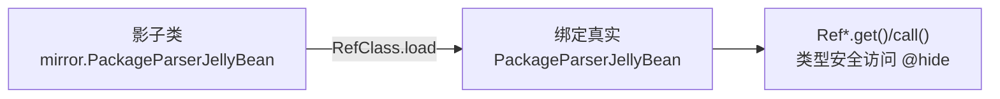

# mirror · PackageParserJellyBean

::: tip 源码路径
[`src/main/java/mirror/android/content/pm/PackageParserJellyBean.java`](https://github.com/android-security-engineer/VirtualXposed-skills/blob/vxp/VirtualApp/lib/src/main/java/mirror/android/content/pm/PackageParserJellyBean.java)
:::

镜像真实类 `android.content.pm.PackageParser`，用 Ref 引用对象包装其隐藏成员。

## 镜像的字段/方法

  - public static RefMethod&lt;Void&gt; collectCertificates
  - public static RefConstructor&lt;PackageParser&gt; ctor
  - public static RefStaticMethod&lt;ActivityInfo&gt; generateActivityInfo
  - public static RefStaticMethod&lt;ApplicationInfo&gt; generateApplicationInfo
  - public static RefStaticMethod&lt;PackageInfo&gt; generatePackageInfo
  - public static RefStaticMethod&lt;ProviderInfo&gt; generateProviderInfo
  - public static RefStaticMethod&lt;ServiceInfo&gt; generateServiceInfo
  - public static RefMethod&lt;PackageParser.Package&gt; parsePackage

## 用途

配合 `RefClass.load` 在运行时绑定到真实 Android 类的对应成员，让 VirtualXposed 以类型安全方式访问这些隐藏 API。详见 [反射框架 mirror](/features/mirror-reflection) 与 [mirror 总览](/reference/mirror/).

## 真实类与使用方

镜像的真实类为 `android.content.pm.PackageParser`（@hide 隐藏 API），被以下模块引用：

| 使用方 | 模块 |
| --- | --- |
| `parser/PackageParserEx.java` | [server/pm](/reference/server/pm) |
## 镜像绑定与访问

