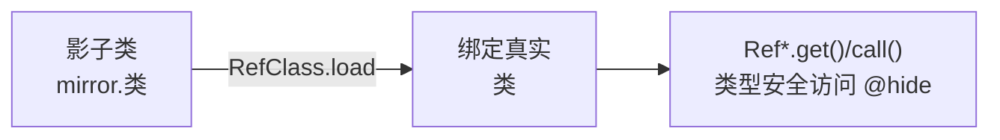

# mirror 镜像类总表

::: tip 源码路径
[src/main/java/mirror/android/](https://github.com/android-security-engineer/VirtualXposed-skills/tree/vxp/VirtualApp/lib/src/main/java/mirror/android/) + `mirror/com/` + 其他
:::

mirror 体系下**每个镜像类**的完整清单（共 144 个），每类一篇文档。这些文档由源码自动提取字段/方法生成，列出该镜像类绑定的隐藏 API。

## 按包浏览

各子包的总览见 [mirror 总览](/reference/mirror/)，这里列出全部单类文档，按真实 Android 包分组。

## android.app（应用框架）

- [ActivityThread](./app_activitythread) — 进程主线程（mH/mBoundApplication/makeApplication）
- [ActivityManagerNative](./app_activitymanagernative) — AMS 单例（gDefault）
- [IActivityManager 系列](./app_iactivitymanagerl) — AMS 接口各版本
- [LoadedApk](./app_loadedapk) — APK 加载信息
- [ContextImpl 系列](./app_contextimpl) — Context 内部
- [NotificationManager/Notification](./app_notificationmanager) — 通知字段

## android.os（OS）

- [ServiceManager](./os_servicemanager) — sCache/getService（系统服务劫持支点）
- [Build](./os_build) — SERIAL 字段
- [Handler](./os_handler) — mCallback

## android.content（内容）

- [ClipboardManager](./content_clipboardmanager) — 剪贴板服务
- [IContentProvider](./content_icontentprovider) — CP 接口
- [IIntentReceiver](./content_iintentreceiver) — 广播接收器

## 其他包

- android/view · telephony · net · media · location · hardware — 各子系统镜像
- com/android/internal — 内部框架类（ITelephony/ISms 等）
- libcore/io · dalvik/system — 底层 IO 与 dex

::: tip 如何找类
用左上角搜索框输入真实类名（如 `ActivityThread`、`ServiceManager`）可直接定位对应镜像文档。
:::

## 镜像绑定与访问

