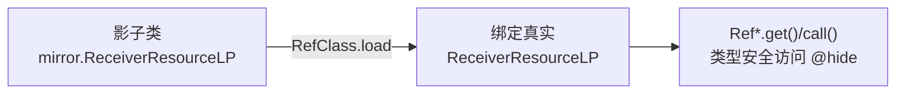

# mirror · ReceiverResourceLP

::: tip 源码路径
[`src/main/java/mirror/android/rms/resource/ReceiverResourceLP.java`](https://github.com/android-security-engineer/VirtualXposed-skills/blob/vxp/VirtualApp/lib/src/main/java/mirror/android/rms/resource/ReceiverResourceLP.java)
:::

镜像真实类 `android.rms.resource.ReceiverResource`，用 Ref 引用对象包装其隐藏成员。

## 镜像的字段/方法

  - public static RefObject&lt;Object&gt; mResourceConfig

## 用途

配合 `RefClass.load` 在运行时绑定到真实 Android 类的对应成员，让 VirtualXposed 以类型安全方式访问这些隐藏 API。详见 [反射框架 mirror](/features/mirror-reflection) 与 [mirror 总览](/reference/mirror/).

## 真实类与使用方

镜像的真实类为 `android.rms.resource.ReceiverResource`（@hide 隐藏 API），被以下模块引用：

| 使用方 | 模块 |
| --- | --- |
| `am/BroadcastSystem.java` | [server/am](/reference/server/am) |
## 镜像绑定与访问

