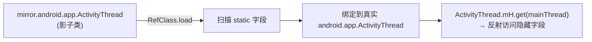

# 反射镜像 mirror

::: tip 源码路径
[`src/main/java/mirror/`](https://github.com/android-security-engineer/VirtualXposed-skills/tree/vxp/VirtualApp/lib/src/main/java/mirror)
:::

`mirror` 是 Android 隐藏 API 的**类型安全反射镜像**。`mirror.android.app.ActivityThread` 镜像真实 `android.app.ActivityThread`，把隐藏字段/方法包装成普通静态字段访问。详见 [反射框架 mirror](../../features/mirror-reflection)。

## 工作原理

`RefClass.load(影子类, 真实类名)` 扫描影子类的静态字段，按字段类型（`RefMethod`/`RefObject`/`RefInt`...）实例化引用对象，绑定到真实类的同名成员。

## 子包镜像映射

mirror 按真实 Android 包结构组织，共 ~120 个文件：

| mirror 子包 | 真实包 | 文件数 | 镜像的典型类 |
| --- | --- | --- | --- |
| [`android/content`](./mirror-content) | android.content | 40 | ClipboardManager/ContentProvider |
| [`android/app`](./mirror-app) | android.app | 37 | ActivityThread/ActivityManagerNative/LoadedApk |
| [`android/os`](./mirror-os) | android.os | 16 | ServiceManager/Build/Handler |
| [`android/view`](./mirror-view) | android.view | 9 | ViewRootImpl/WindowManagerImpl |
| [`android/telephony`](./mirror-telephony) | android.telephony | 7 | TelephonyManager |
| [`android/net`](./mirror-net) | android.net | 6 | NetworkInfo |
| [`android/media`](./mirror-media) | android.media | 5 | AudioRecord/Camera |
| [`android/location`](./mirror-location) | android.location | 4 | LocationManager |
| [`android/hardware`](./mirror-hardware) | android.hardware | 4 | Camera/SensorManager |
| `rms` / `rms/resource` | android.rms | 3 | 资源管理（见[其他子包](./mirror-misc)） |
| 其他 | widget/webkit/ddm/util/service/renderscript/providers/graphics/bluetooth/accounts | 各 1-2 | — |
| `com/android/internal/*` | com.android.internal.* | ~15 | 内部框架类 |
| `dalvik/system` `java/lang` `libcore/io` | 对应包 | ~5 | DexFile/Libcore |
| `mirror/android/security/net/config` | 安全配置 | — | — |

::: tip 版本化镜像类
清单里会出现 `IActivityManagerN`、`IActivityManagerL`、`ActivityManagerNativeOreo` 这类带版本后缀的类——同一个真实类在不同 Android 版本方法集不同，按版本拆成多个影子类，运行时由 hook 代码按 [`BuildCompat`](../helper/compat/build-compat) 选正确版本。详见 [Ref 引用框架](./mirror-ref-framework#版本化镜像类)。
:::

## 引用类型

| 类型 | 用途 | 用法 |
| --- | --- | --- |
| `RefMethod<T>` | 实例方法 | `ref.call(obj, args...)` |
| `RefStaticMethod<T>` | 静态方法 | `ref.call(args...)` |
| `RefObject<T>` | 实例字段 | `ref.get(obj)` / `ref.set(obj, val)` |
| `RefStaticObject<T>` | 静态字段 | `ref.get()` / `ref.set(val)` |
| `RefInt`/`RefLong`/... | 基本类型字段 | `ref.get(obj)` |
| `RefConstructor<T>` | 构造方法 | `ref.newInstance(args...)` |

各子包文档见下方。完整类清单请直接对照源码目录。
