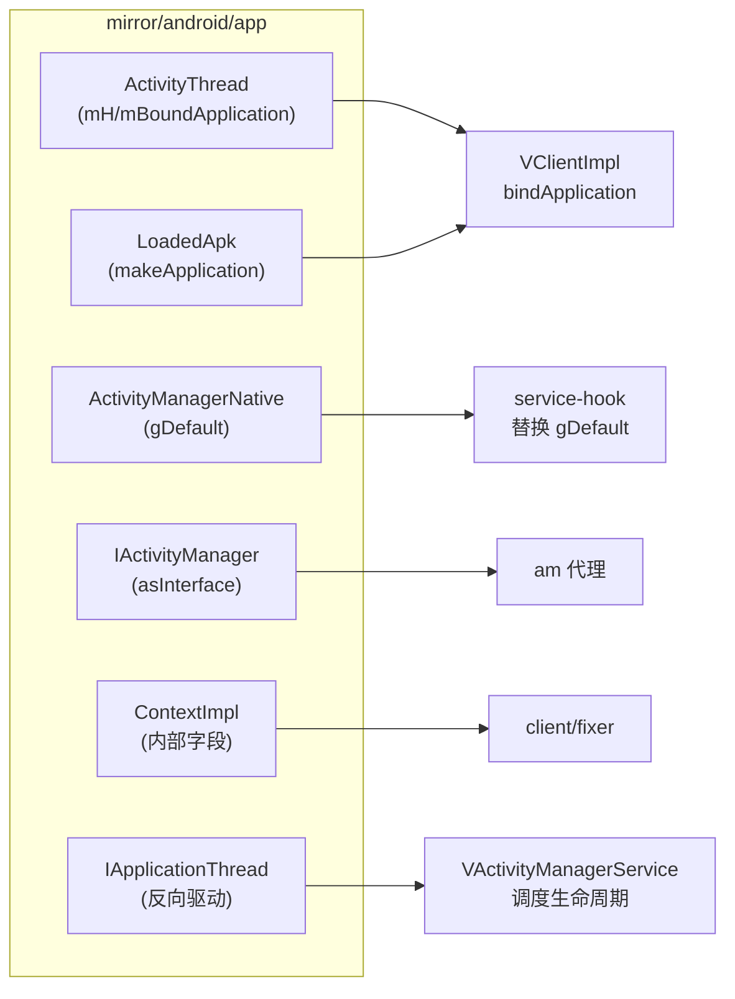

# mirror/android/app · 应用框架镜像

::: tip 源码路径
[`src/main/java/mirror/android/app/`](https://github.com/android-security-engineer/VirtualXposed-skills/tree/vxp/VirtualApp/lib/src/main/java/mirror/android/app)
:::

镜像 `android.app` 包的隐藏类，共 ~37 个类——mirror 里最大的一组，因为应用虚拟化要深度介入 ActivityThread/ApplicationThread/ActivityManager。

## 关键镜像类

| 镜像类 | 真实类 | 用途 |
| --- | --- | --- |
| `ActivityThread` / `ActivityThreadNMR1` | ActivityThread | `mH`/`mBoundApplication`/`currentActivityThread`/`makeApplication` |
| `ActivityManagerNative` | ActivityManagerNative | `gDefault`（AMS 单例，[service-hook](../../features/service-hook) 替换点） |
| `IActivityManager` 及各版本（ICS/N/L/...） | IActivityManager | AMS 接口，取 `asInterface` |
| `IActivityTaskManager` | IActivityTaskManager | Android 10+ ATMS 接口 |
| `LoadedApk` / `LoadedApkHuaWei` | LoadedApk | `makeApplication`/`mClassLoader`（华为特殊版本） |
| `ContextImpl` / `ContextImplICS` / `ContextImplKitkat` | ContextImpl | Context 内部字段（[fixer](../client/fixer) 用） |
| `IApplicationThread` 及各版本 | IApplicationThread | 应用线程接口（server 反向驱动客户端） |
| `ApplicationThreadNative` / `ServiceStartArgs` | ApplicationThread* | 应用线程桩 |
| `NotificationManager` / `Notification` / `NotificationL` / `NotificationM` | Notification* | 通知字段（[notification 服务](../server/notification) 用） |
| `PendingIntentJBMR2` | PendingIntent | PendingIntent 字段 |
| `ISearchManager` / `IAlarmManager` / `IUsageStatsManager` | 对应接口 | 各服务接口 |
| `Activity` / `ActivityManager` / `ActivityManagerOreo` / `Service` / `ContextImpl` | 对应类 | 框架类字段 |
| `IServiceConnectionO` | IServiceConnection | Service 连接接口 |

## 版本后缀说明

类名后缀（ICS/N/L/JBMR2/Kitkat/Oreo）表示该版本特有的结构差异——同一隐藏类在不同 Android 版本字段/方法不同，mirror 为每个版本单独镜像，运行时按 `SDK_INT` 选合适的。

## 镜像类与使用方

`ActivityManagerNative.gDefault` 是系统服务劫持的支点——[service-hook](../../features/service-hook) 替换它注入所有代理。
