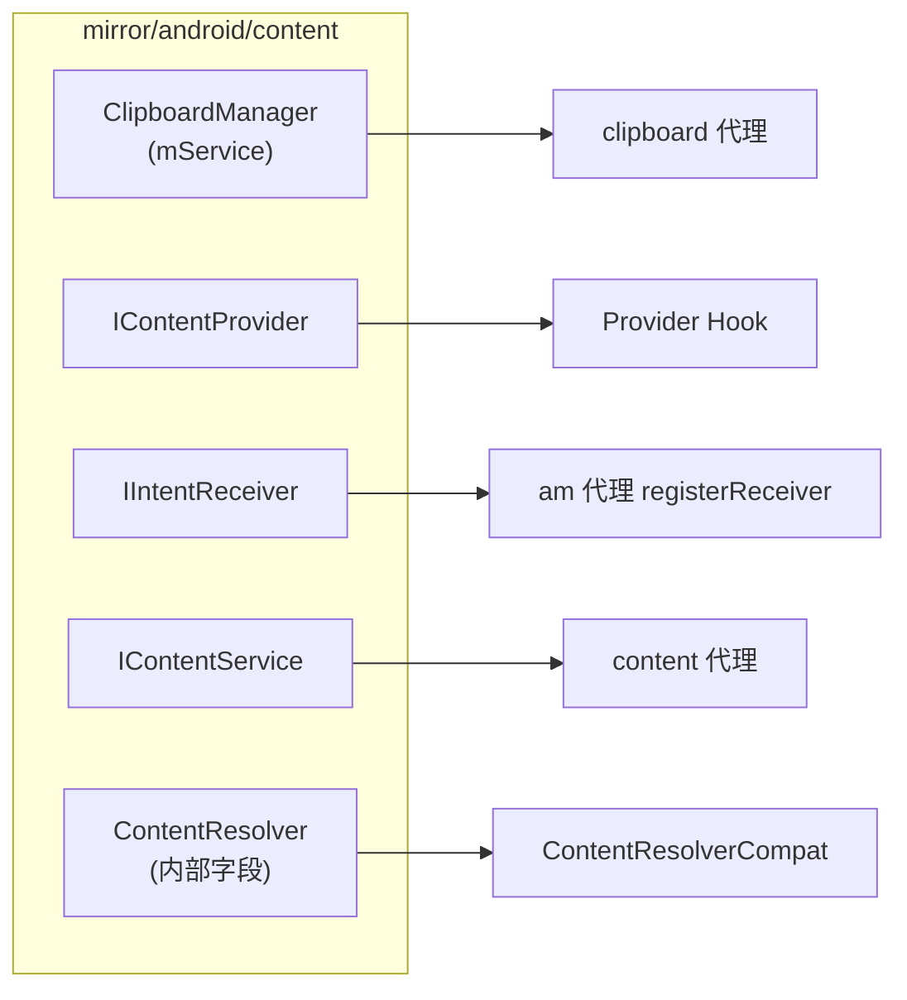

# mirror/android/content · 内容镜像

::: tip 源码路径
[`src/main/java/mirror/android/content/`](https://github.com/android-security-engineer/VirtualXposed-skills/tree/vxp/VirtualApp/lib/src/main/java/mirror/android/content)
:::

镜像 `android.content` 包的隐藏类，共 ~18 个类。覆盖剪贴板、ContentProvider、Intent 接收器、同步等。

## 镜像的类

| 镜像类 | 真实类 | 用途 |
| --- | --- | --- |
| `ClipboardManager` / `ClipboardManagerOreo` | ClipboardManager | 取/设系统剪贴板服务字段（[clipboard 代理](../proxies/clipboard) 用） |
| `ContentProviderClient` / `ContentProviderNative` / `ContentProviderHolderOreo` | ContentProvider* | CP 客户端/Holder 隐藏字段 |
| `ContentResolver` / `ContentResolverJBMR2` | ContentResolver | ContentResolver 内部字段 |
| `IContentProvider` | IContentProvider | CP 跨进程接口 |
| `IIntentReceiver` / `IIntentReceiverJB` / `BroadcastReceiver` | IIntentReceiver | 广播接收器接口（[am 代理](../proxies/am) 的 RegisterReceiver 用） |
| `IContentService` | IContentService | 内容服务接口 |
| `IClipboard` | IClipboard | 剪贴板接口 |
| `IRestrictionsManager` | IRestrictionsManager | 限制管理接口 |
| `IntentFilter` / `SyncAdapterType` / `SyncAdapterTypeN` / `SyncInfo` / `SyncRequest` | 对应类 | Intent 过滤/同步相关 |

多为各代理取 `IInterface` 句柄或访问内部缓存时使用。

## 镜像类与使用方

