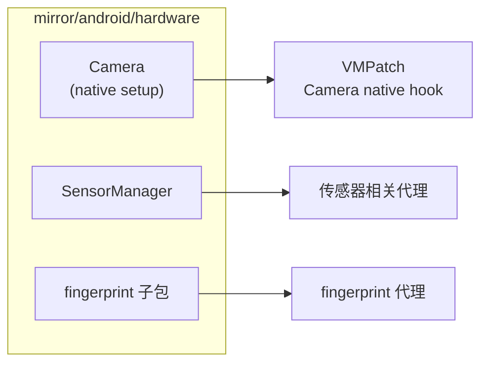

# mirror/android/hardware · 硬件镜像

::: tip 源码路径
[`src/main/java/mirror/android/hardware/`](https://github.com/android-security-engineer/VirtualXposed-skills/tree/vxp/VirtualApp/lib/src/main/java/mirror/android/hardware)
:::

镜像 `android.hardware` 包的隐藏类，共 4 个类。

## 镜像的类

| 镜像类 | 真实类 | 用途 |
| --- | --- | --- |
| `Camera` | Camera | 摄像头 native 方法（`NativeMethods.gCameraNativeSetup`） |
| `SensorManager` | SensorManager | 传感器字段 |
| `display` 子包 | 显示硬件 | — |
| `fingerprint` 子包 | 指纹 | （[fingerprint 代理](../proxies/fingerprint)） |
| `location` 子包 | 硬件定位 | — |

`Camera` 的 native 方法 hook 见 [Native 层](../../features/native-layer) 的 `VMPatch`。

## 镜像类与使用方

