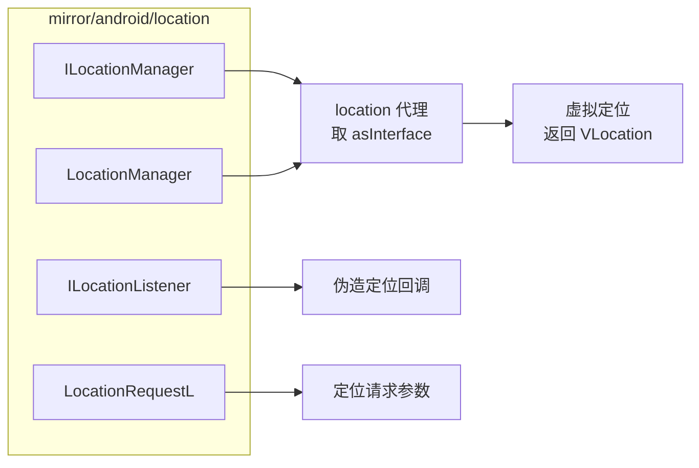

# mirror/android/location · 定位镜像

::: tip 源码路径
[`src/main/java/mirror/android/location/`](https://github.com/android-security-engineer/VirtualXposed-skills/tree/vxp/VirtualApp/lib/src/main/java/mirror/android/location)
:::

镜像 `android.location` 包的隐藏类，共 4 个类——[虚拟定位](../../features/virtual-location) 直接相关。

## 镜像的类

| 镜像类 | 真实类 | 用途 |
| --- | --- | --- |
| `ILocationManager` | ILocationManager | 定位服务接口（[location 代理](../proxies/location)） |
| `LocationManager` | LocationManager | 定位管理字段 |
| `ILocationListener` | ILocationListener | 定位监听器接口（伪造回调用） |
| `LocationRequestL` | LocationRequest | 定位请求字段（Android L+） |

## 镜像类与使用方

