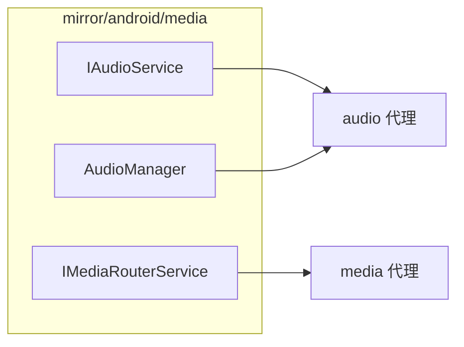

# mirror/android/media · 媒体镜像

::: tip 源码路径
[`src/main/java/mirror/android/media/`](https://github.com/android-security-engineer/VirtualXposed-skills/tree/vxp/VirtualApp/lib/src/main/java/mirror/android/media)
:::

镜像 `android.media` 包的隐藏类，共 5 个类。

## 镜像的类

| 镜像类 | 真实类 | 用途 |
| --- | --- | --- |
| `IAudioService` | IAudioService | 音频服务接口（[audio 代理](../proxies/audio)） |
| `AudioManager` | AudioManager | 音频管理字段 |
| `IMediaRouterService` | MediaRouter 接口 | 媒体路由（[media 代理](../proxies/media)） |
| `MediaRouter` | MediaRouter | 路由字段 |

## 镜像类与使用方

