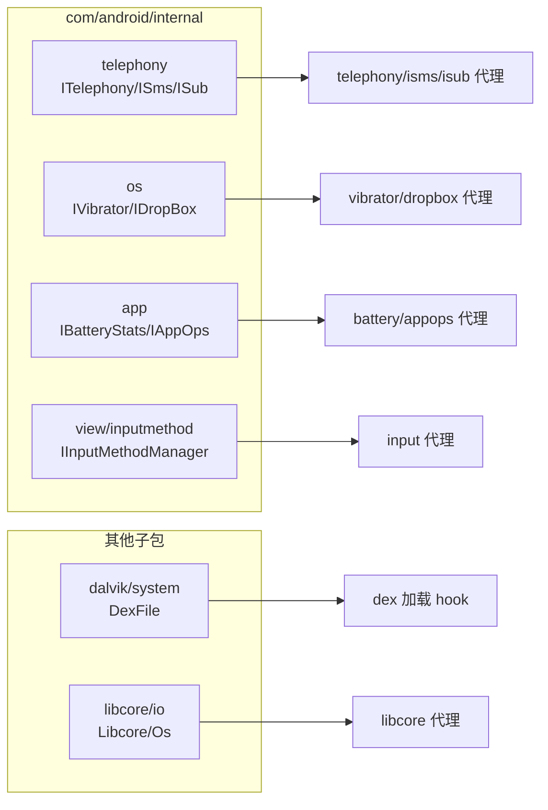

# mirror 其他子包

::: tip 源码路径
[src/main/java/mirror/android/](https://github.com/android-security-engineer/VirtualXposed-skills/tree/vxp/VirtualApp/lib/src/main/java/mirror/android/) 下其余子包 + `mirror/com/` + `mirror/dalvik/` + `mirror/java/` + `mirror/libcore/`
:::

## mirror/android 其余

| 子包 | 内容 |
| --- | --- |
| `rms` / `rms/resource` | 资源管理服务（3 类） |
| `widget` | Widget 字段（2 类） |
| `webkit` | WebKit 字段（2 类） |
| `ddm` | DDMS 调试（2 类） |
| `util` / `service` / `renderscript` / `providers` / `graphics` / `bluetooth` / `accounts` | 各 1 类 |
| `service/persistentdata` | 持久数据块服务 |

## mirror/com/android/internal

镜像 `com.android.internal`——Android 内部框架类，约 15 个，覆盖多个子系统：

| 子包 | 镜像类 | 用途 |
| --- | --- | --- |
| `telephony` | `ITelephony`/`ITelephonyRegistry`/`IPhoneSubInfo`/`ISms`/`IMms`/`ISub`/`PhoneConstantsMtk` | 电话各接口（对应 [telephony](../proxies/telephony)/[phonesubinfo](../proxies/phonesubinfo)/[isms](../proxies/isms)/[isub](../proxies/isub) 代理） |
| `os` | `IVibratorService`/`IDropBoxManagerService`/`UserManager`/`health/SystemHealthManager` | 系统 Service 接口 |
| `app` | `IBatteryStats`/`IAppOpsService` | 电池/应用操作接口 |
| `content` | `NativeLibraryHelper`/`ReferrerIntent` | native 库抽取/Referrer |
| `view` / `view/inputmethod` | `IInputMethodManager`/`InputMethodManager` | 输入法 |
| `appwidget` | `IAppWidgetService` | 桌面小部件接口 |
| `policy` | `PhoneWindow` | 窗口策略 |

`ITelephony`/`IPhoneSubInfo`/`ISms` 等接口是各电话类代理取 `asInterface` 的来源。

## mirror/dalvik · java · libcore

| 子包 | 镜像类 | 用途 |
| --- | --- | --- |
| `dalvik/system` | `DexFile`/`PathList` 等 | dex 加载（`openDexFileNative` hook） |
| `java/lang` | `reflect` 相关 | 反射内部 |
| `libcore/io` | `Libcore`/`Os` | 底层 IO（[libcore 代理](../proxies/libcore)） |
| `mirror/android/security/net/config` | 网络安全配置 | — |

::: tip 为什么要镜像这么多
VirtualXposed 要在用户态重实现系统服务，必须访问大量 `@hide` 接口和内部字段。mirror 把这些访问变成类型安全的静态字段调用，配合 `free_reflection` 解封，跨 5.0~10.0 版本工作。每个版本字段差异靠后缀类 + `SDK_INT` 分支适配。
:::

## 各子包与使用方总览

