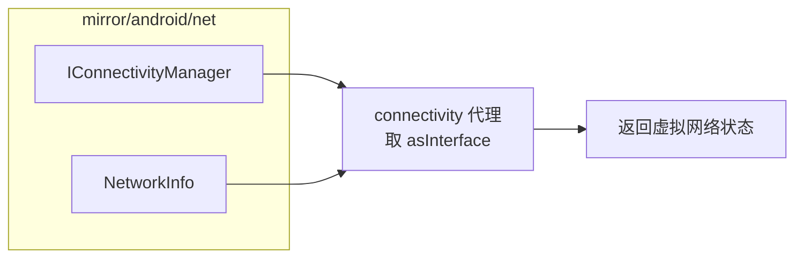

# mirror/android/net · 网络镜像

::: tip 源码路径
[`src/main/java/mirror/android/net/`](https://github.com/android-security-engineer/VirtualXposed-skills/tree/vxp/VirtualApp/lib/src/main/java/mirror/android/net)
:::

镜像 `android.net` 包的隐藏类，共 6 个类。

## 镜像的类

| 镜像类 | 真实类 | 用途 |
| --- | --- | --- |
| `IConnectivityManager` | IConnectivityManager | 连接管理接口（[connectivity 代理](../proxies/connectivity)） |
| `NetworkInfo` | NetworkInfo | 网络信息字段 |
| 其他 | wifi 相关 | （`android/net/wifi` 子包） |

主要是取 `IConnectivityManager` 句柄和访问 `NetworkInfo` 内部状态。

## 镜像类与使用方

