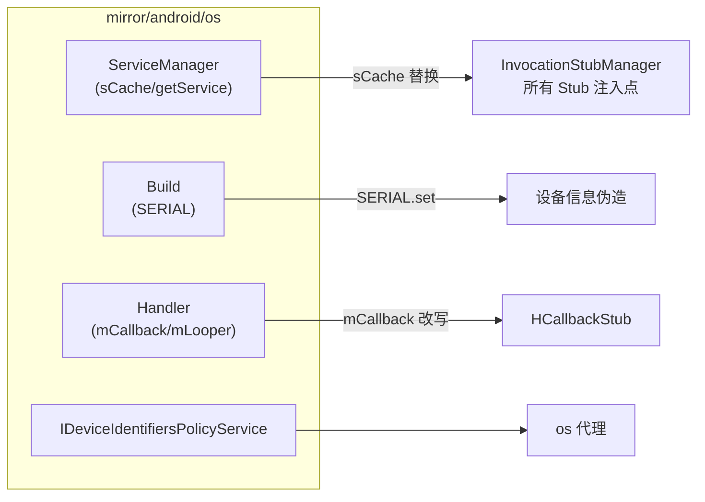

# mirror/android/os · OS 镜像

::: tip 源码路径
[`src/main/java/mirror/android/os/`](https://github.com/android-security-engineer/VirtualXposed-skills/tree/vxp/VirtualApp/lib/src/main/java/mirror/android/os)
:::

镜像 `android.os` 包的隐藏类，共 ~16 个类。包含 VirtualXposed 最核心的几个镜像：`ServiceManager`/`Build`/`Handler`。

## 关键镜像类

| 镜像类 | 真实类 | 用途 |
| --- | --- | --- |
| `ServiceManager` | ServiceManager | `sCache`（[service-hook](../../features/service-hook) 的替换目标）/`getService` |
| `Build` | Build | `SERIAL`（[设备信息伪造](../../features/device-spoofing) 反射改写） |
| `Handler` | Handler | `mCallback`/`mLooper`（[am 代理](../proxies/am) 的 HCallbackStub 改 mCallback） |
| `Message` / `Bundle` / `BundleICS` / `BaseBundle` | Message/Bundle | 消息/Bundle 内部字段 |
| `UserHandle` / `IUserManager` | UserHandle/IUserManager | 多用户 |
| `IDeviceIdentifiersPolicyService` | IDeviceIdentifiersPolicyService | 设备标识策略（[os 代理](../proxies/os)） |
| `IPowerManager` | IPowerManager | 电源接口 |
| `INetworkManagementService` | INetworkManagementService | 网络管理接口 |
| `Process` / `StrictMode` | Process/StrictMode | 进程/严格模式字段 |

`ServiceManager.sCache` 是整个系统服务劫持的支点——所有 `XxxStub` 都通过它注入。

## 核心镜像与使用方

三个最关键的镜像：`ServiceManager`（劫持支点）、`Build`（设备伪造）、`Handler`（H Callback 还原）。
