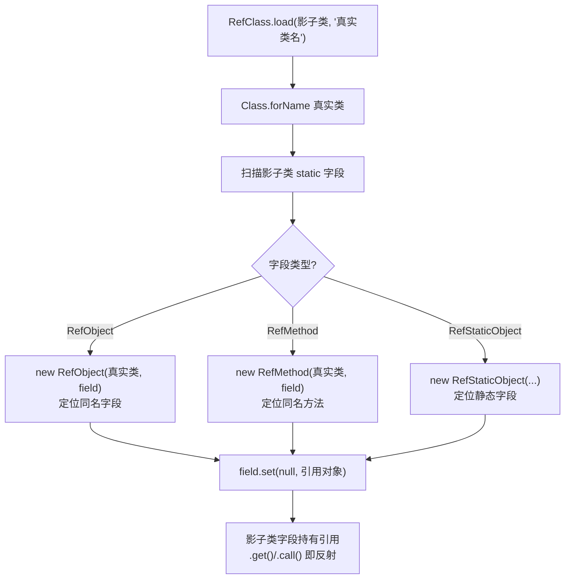
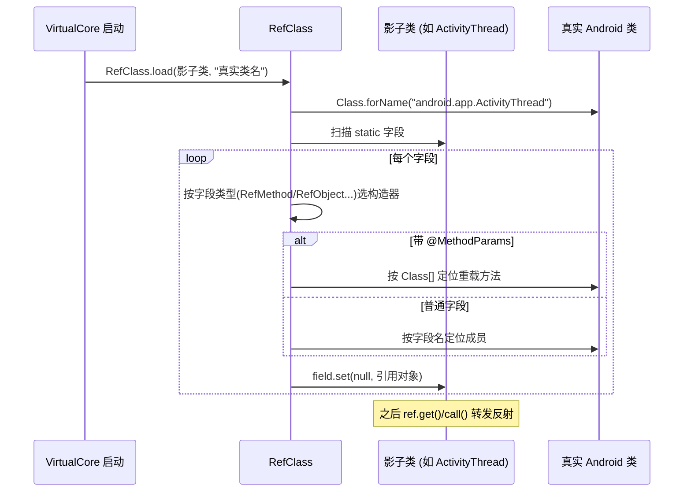

# mirror · Ref 引用框架

::: tip 源码路径
[`src/main/java/mirror/`](https://github.com/android-security-engineer/VirtualXposed-skills/tree/vxp/VirtualApp/lib/src/main/java/mirror)（顶层 Ref*.java）
:::

`mirror` 包顶层的 **13 个 Ref 类**是反射镜像框架的核心——它们定义"引用对象"的类型，`RefClass.load` 据此把影子类字段绑定到真实成员。详见 [反射框架 mirror](/features/mirror-reflection)。

## Ref 类型一览

| 类 | 用途 | 用法 |
| --- | --- | --- |
| `RefClass` | 引用框架入口，`load()` 绑定魔法 | `RefClass.load(影子类, 真实类名)` |
| `RefObject<T>` | 实例字段引用 | `ref.get(obj)` / `ref.set(obj, val)` |
| `RefStaticObject<T>` | 静态字段引用 | `ref.get()` / `ref.set(val)` |
| `RefMethod<T>` | 实例方法引用 | `ref.call(obj, args...)` |
| `RefStaticMethod<T>` | 静态方法引用 | `ref.call(args...)` |
| `RefConstructor<T>` | 构造方法引用 | `ref.newInstance(args...)` |
| `RefInt` / `RefLong` / `RefFloat` / `RefDouble` / `RefBoolean` | 基本类型字段引用 | `ref.get(obj)` |
| `RefStaticInt` | 静态基本类型字段引用 | `ref.get()` |
| `MethodParams` | 方法签名指定（重载区分） | 配合 RefMethod |
| `MethodReflectParams` | 反射参数类型指定 | 配合 RefMethod |

## 绑定机制



每个 Ref 类构造时用反射找到真实类里对应的 `Field`/`Method`/`Constructor` 并记住，之后调用就是转发到反射——但对外表现为类型安全的普通字段访问。

## @MethodParams / @MethodReflectParams：重载区分

真实隐藏类常有方法重载（同名不同参），`RefMethod` 默认按字段名找方法，重载时会撞车。两个注解解决：

| 注解 | 用途 | 示例 |
| --- | --- | --- |
| `@MethodParams({Class...})` | 按编译期已知的 `Class` 区分重载 | `@MethodParams({IBinder.class, int.class})` |
| `@MethodReflectParams` | 按运行时反射拿到的参数类型区分 | 用于参数类型本身是隐藏类时 |

```java
public class IActivityManagerN {
    public static Class<?> TYPE = RefClass.load(IActivityManagerN.class, "android.app.IActivityManager");
    @MethodParams({IBinder.class, int.class, Intent.class, int.class})
    public static RefMethod<Boolean> finishActivity;
}
```

`RefClass.load` 扫到带 `@MethodParams` 的字段时，按注解给的 `Class[]` 精确定位重载版本，而不是只按方法名。

## 版本化镜像类

注意源码里有 `IActivityManagerN`、`IActivityManagerL`、`IActivityManagerICS` 这类**带版本后缀**的影子类。同一个真实类 `android.app.IActivityManager` 在不同 Android 版本方法集不同（Nougat 加了 `finishActivity` 的四参重载），单用一个影子类装不下。

解法：按版本拆成多个影子类，各镜像该版本新增的成员，运行时由 hook 代码按 [`BuildCompat`](../helper/compat/build-compat) 选正确版本调用。后缀约定：

| 后缀 | 含义 |
| --- | --- |
| `ICS` / `JB` / `JBMR1` / `L` / `N` / `O` | 对应 Android 版本（IceCreamSandwich / JellyBean / Lollipop / Nougat / Oreo…） |
| 无后缀 | 跨版本通用的基础成员 |

## 绑定流程时序



## 绑定失败

真实类不存在（被新版本删掉）或成员签名不匹配时，Ref 构造会捕获异常并把该字段置为空引用，后续 `.get()`/`.call()` 抛 [`ReflectException`](../helper/utils/reflect-exception) 而非 `NullPointerException`——便于在调用点按版本降级处理。

## 关联

- [反射框架 mirror](/features/mirror-reflection)：机制总览。
- [`BuildCompat`](../helper/compat/build-compat)：版本判定，决定用哪个版本化影子类。
- [`ReflectException`](../helper/utils/reflect-exception)：绑定/调用失败异常。
- [mirror 总览](./)：子包与类清单。
