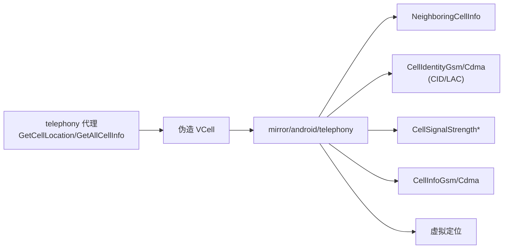

# mirror/android/telephony · 电话镜像

::: tip 源码路径
[`src/main/java/mirror/android/telephony/`](https://github.com/android-security-engineer/VirtualXposed-skills/tree/vxp/VirtualApp/lib/src/main/java/mirror/android/telephony)
:::

镜像 `android.telephony` 包的隐藏类，共 7 个类。全部围绕**基站/小区信息**——[虚拟定位](../../features/virtual-location) 伪造基站时用到。

## 镜像的类

| 镜像类 | 真实类 | 用途 |
| --- | --- | --- |
| `NeighboringCellInfo` | NeighboringCellInfo | 邻区基站 |
| `CellInfoGsm` / `CellInfoCdma` | CellInfoGsm/Cdma | GSM/CDMA 小区信息 |
| `CellIdentityGsm` / `CellIdentityCdma` | CellIdentity* | 小区标识（CID/LAC） |
| `CellSignalStrengthGsm` / `CellSignalStrengthCdma` | CellSignalStrength* | 信号强度 |

[telephony 代理](../proxies/telephony) 的 `GetCellLocation`/`GetAllCellInfo` 返回伪造 `VCell`，构造这些对象时通过 mirror 访问其隐藏构造/字段。
## 基站镜像与虚拟定位

