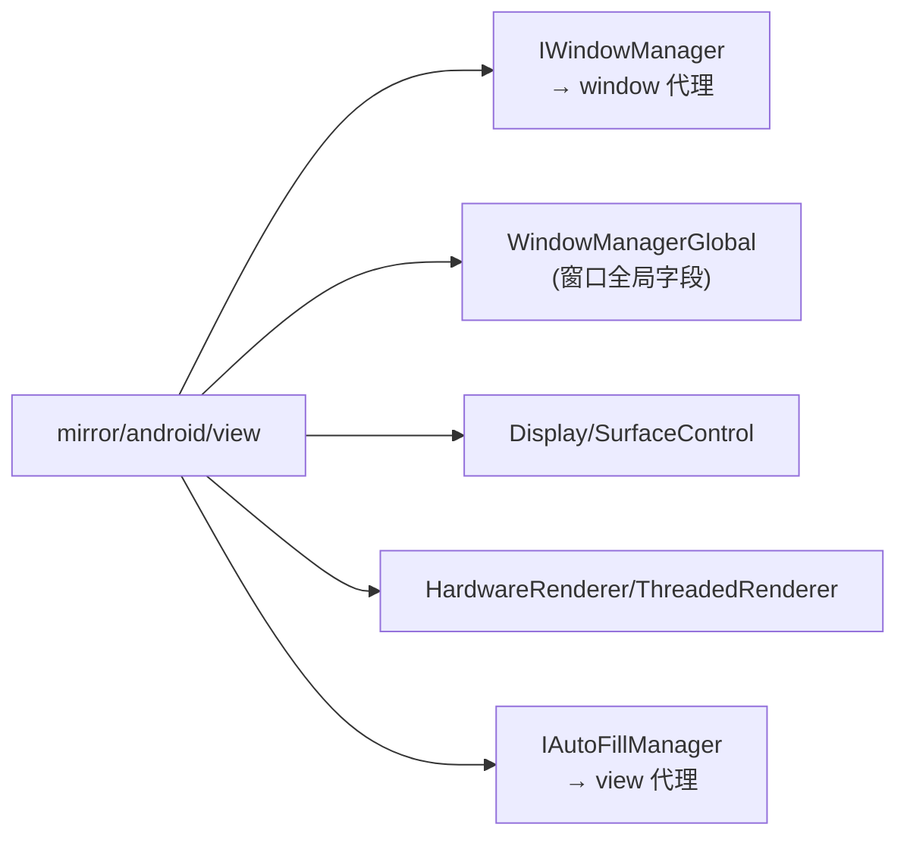

# mirror/android/view · 视图镜像

::: tip 源码路径
[`src/main/java/mirror/android/view/`](https://github.com/android-security-engineer/VirtualXposed-skills/tree/vxp/VirtualApp/lib/src/main/java/mirror/android/view)
:::

镜像 `android.view` 包的隐藏类，共 ~9 个类。覆盖窗口、显示、渲染。

## 镜像的类

| 镜像类 | 真实类 | 用途 |
| --- | --- | --- |
| `IWindowManager` | IWindowManager | 窗口管理接口（[window 代理](../proxies/window)） |
| `WindowManagerGlobal` | WindowManagerGlobal | 窗口全局字段 |
| `Display` / `SurfaceControl` | Display/SurfaceControl | 显示/Surface 控制 |
| `HardwareRenderer` / `ThreadedRenderer` | 硬件渲染 | 渲染管线字段 |
| `RenderScript` | RenderScript | RenderScript |
| `IAutoFillManager` | IAutoFillManager | 自动填充接口（[view 代理](../proxies/view)） |
| `IGraphicsStats` | IGraphicsStats | 图形统计接口 |
## view 镜像与使用方

