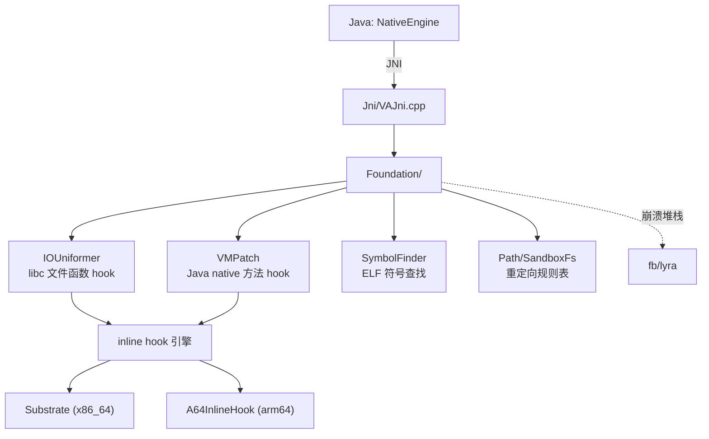

# native · Native 层 (libva++.so)

::: tip 源码路径
[`src/main/jni/`](https://github.com/android-security-engineer/VirtualXposed-skills/tree/vxp/VirtualApp/lib/src/main/jni)
:::

VirtualXposed 的 native 层，编译成 `libva++.so`，由 [`NativeEngine`](../client/native-engine) 加载。共 **90 个源文件**，分五个目录。详见 [Native 层](../../features/native-layer)。

## 目录组成

| 目录 | 文件数 | 职责 | 文档 |
| --- | --- | --- | --- |
| `Jni/` | 3 | JNI 桥接（`NativeEngine` 的 native 方法实现） | [JNI 桥接](./native-jni) |
| `Foundation/` | ~12 | 核心功能：IO 重定向/ART hook/符号查找/路径表 | [Foundation](./native-foundation) |

Foundation 已按文件拆为 6 篇细分文档：[IOUniformer](./native-io-uniformer)、[SandboxFs](./native-sandbox-fs)、[Path](./native-path)、[fake_dlfcn](./native-fake-dlfcn)、[SymbolFinder](./native-symbol-finder)、[VMPatch](./native-vm-patch)。
| `Substrate/` | ~11 | x86_64 inline hook 库 | [Substrate](./native-substrate) |
| `A64Inlinehook/` | 2 | arm64 专用 inline hook | [A64InlineHook](./native-a64) |
| `fb/` | ~10 | Facebook lyra 异常处理 | [fb/lyra](./native-fb) |

## 分层

## ABI

当前只产出 `arm64-v8a` 和 `x86_64`（`lib/build.gradle` 的 `abiFilters`），是个 64 位包（`io.va.exposed64`）。
