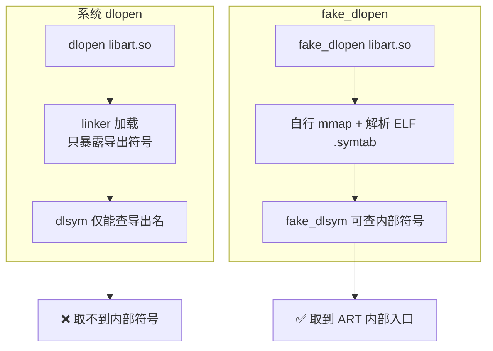

# native/Foundation/fake_dlfcn · 绕过 linker 的 dlopen

::: tip 源码路径
[`src/main/jni/Foundation/fake_dlfcn.cpp`](https://github.com/android-security-engineer/VirtualXposed-skills/blob/vxp/VirtualApp/lib/src/main/jni/Foundation/fake_dlfcn.cpp)
:::

189 行。自行解析 ELF（不依赖系统 linker 的 `dlopen`），用于访问系统 so 里 linker 不暴露的内部符号（如 libart.so 的 ART 方法入口）。配合 [SymbolFinder](./native-symbol-finder) 使用。

## 关键函数

从源码提取：

| 函数 | 作用 |
| --- | --- |
| `fake_dlopen(const char *libpath, int flags)` | 自行 mmap so 文件、解析 ELF 头，返回 `struct ctx *`（不调用系统 dlopen） |
| `fake_dlsym(void *handle, const char *name)` | 在 fake_dlopen 解析出的符号表里按名查找 |
| `fake_dlclose(void *handle)` | 释放 ctx 与 mmap 的内存 |

## 与系统 dlopen 的区别

`struct ctx` 持有 mmap 的基址、符号表（`symtab`）、字符串表（`strtab`）与条目数，`fake_dlsym` 直接遍历 `.symtab`，因此能命中 linker 不导出的符号——这是 [VMPatch](./native-vm-patch) hook ART 方法的前提。

## 适用场景

- 系统 so 已被 linker 加载，但所需符号未导出 → 用 `fake_dlopen` 重新解析同一文件的 `.symtab`
- 需要符号的文件偏移而非运行时地址 → `fake_dlsym` 返回的是相对基址的偏移，加基址得运行时地址
- 运行时地址查找（带 PID、跨进程）走 [SymbolFinder](./native-symbol-finder) 而非 fake_dlfcn
