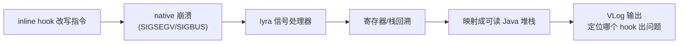

# native/fb · lyra 异常处理

::: tip 源码路径
[`src/main/jni/fb/`](https://github.com/android-security-engineer/VirtualXposed-skills/tree/vxp/VirtualApp/lib/src/main/jni/fb)
:::

Facebook 开源的 JNI 异常处理库（lyra），约 10 个文件。让 native 崩溃（SIGSEGV/SIGBUS 等）时生成**可读的 Java 堆栈**，而非裸 native 地址。

## 文件组成

| 文件 | 职责 |
| --- | --- |
| `onload.cpp` | JNI `onLoad` 注册信号处理器 |
| `assert.cpp` / `log.cpp` | 断言/日志 |
| `lyra/` | lyra 核心（崩溃栈回溯到 Java 帧） |
| `jni/` / `include/` | JNI 与头文件 |
| `Android.mk` | 构建配置 |

## 作用

inline hook 改写了大量函数指令，一旦出错容易触发 native 崩溃。lyra 捕获信号，把崩溃时的寄存器/栈回溯成可读信息，便于定位是哪个 hook 出问题。对调试 VirtualXposed 在不同设备/版本的兼容性问题很重要。
## lyra 异常处理流

