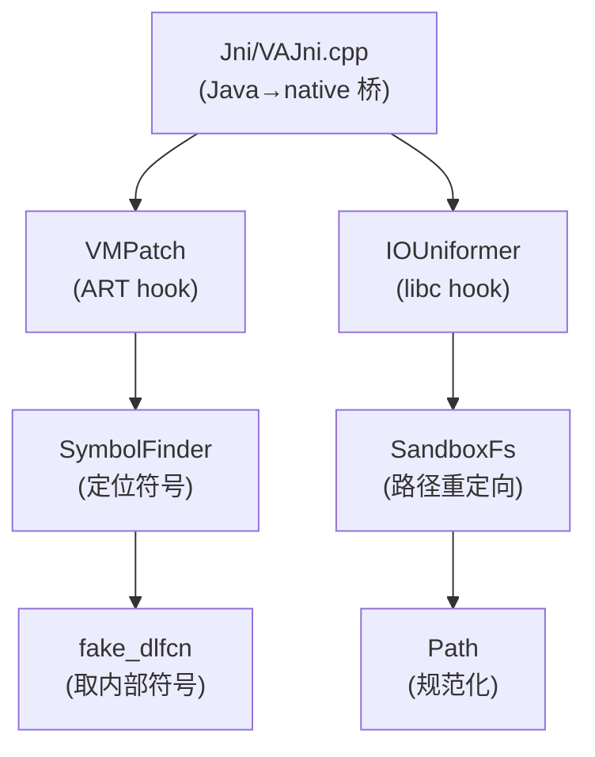
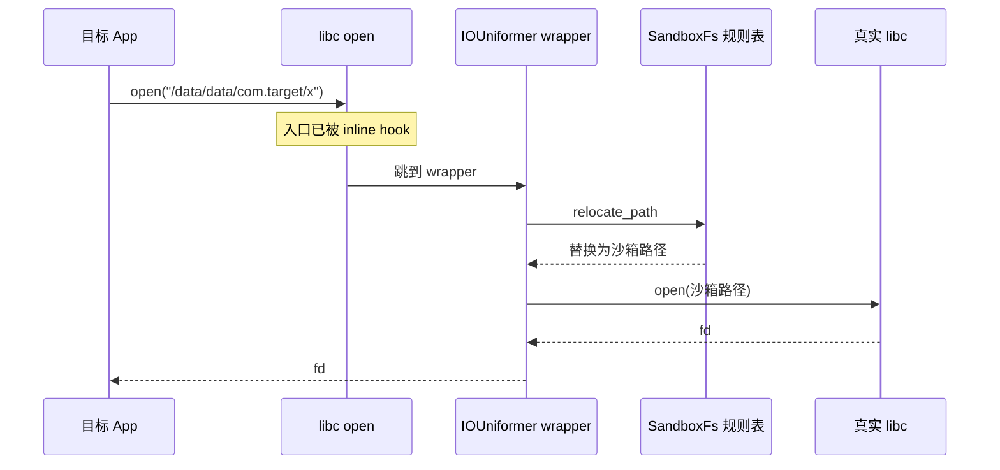

# native/Foundation · 核心功能综述

::: tip 源码路径
[`src/main/jni/Foundation/`](https://github.com/android-security-engineer/VirtualXposed-skills/tree/vxp/VirtualApp/lib/src/main/jni/Foundation)
:::

native 层核心，12 个文件，承载 IO 重定向、ART 方法 hook、符号查找、路径管理。已按文件拆为 6 篇细分文档：

| 文档 | 源文件 | 职责 |
| --- | --- | --- |
| [IOUniformer](./native-io-uniformer) | IOUniformer.cpp | libc/execve/dlopen hook 总入口 |
| [SandboxFs](./native-sandbox-fs) | SandboxFs.cpp | 路径重定向引擎（keep/forbid/replace 三表） |
| [Path](./native-path) | Path.cpp | 路径规范化工具 |
| [fake_dlfcn](./native-fake-dlfcn) | fake_dlfcn.cpp | 绕过 linker 的 dlopen/dlsym |
| [SymbolFinder](./native-symbol-finder) | SymbolFinder.cpp | ELF 符号运行时地址查找 |
| [VMPatch](./native-vm-patch) | VMPatch.cpp | ART VM 方法 hook 入口 |

## Foundation 在 native 层的位置

## IOUniformer 工作流

详见 [虚拟存储与 IO 重定向](../../features/io-redirect) 与 [Native 层](../../features/native-layer)。
