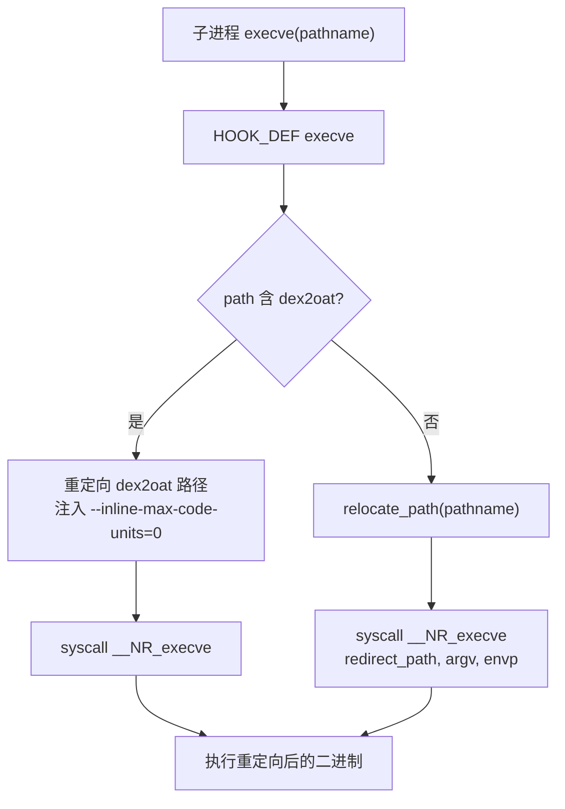
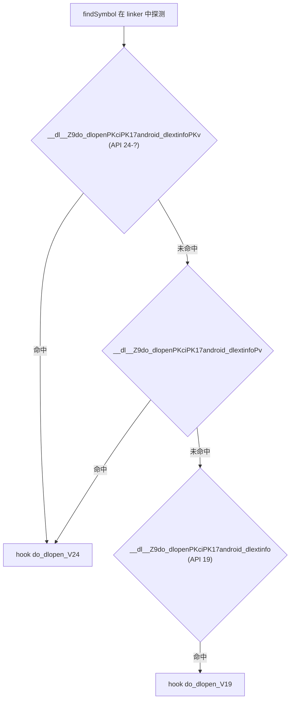

# native/Foundation/IOUniformer · IO 重定向 hook 总入口

::: tip 源码路径
[`src/main/jni/Foundation/IOUniformer.cpp`](https://github.com/android-security-engineer/VirtualXposed-skills/blob/vxp/VirtualApp/lib/src/main/jni/Foundation/IOUniformer.cpp)
:::

native 层 IO 重定向的核心，537 行。hook libc 的 `execve`、linker 的 `do_dlopen`，把路径参数经 [`SandboxFs.relocate_path`](./native-sandbox-fs) 重定向到虚拟沙箱目录。由 [NativeEngine](../client/native-engine) 的 `nativeEnableIORedirect` 触发初始化。

## 核心 API

从源码提取的真实函数：

| 函数 | 作用 |
| --- | --- |
| `IOUniformer::init_env_before_all()` | 全局初始化，读取 `V_KEEP_ITEM_*`/`V_FORBID_ITEM_*`/`V_REPLACE_ITEM_SRC_*`/`V_REPLACE_ITEM_DST_*` 环境变量，注册到 SandboxFs |
| `hook_function(addr, new_func, old_func)` | 按地址 hook（inline hook 封装） |
| `hook_function(handle, symbol, new_func, old_func)` | 按符号名 hook |
| `HOOK_DEF(int, execve, pathname, argv, envp)` | 拦截 execve：dex2oat 路径重定向 + 注入 `--inline-max-code-units=0` 阻止内联 |
| `HOOK_DEF(void*, do_dlopen_V19, filename, flag, extinfo)` | Android 9 的 do_dlopen 路径重定向 |
| `HOOK_DEF(void*, do_dlopen_V24, name, flags, extinfo, caller_addr)` | Android 7+ 的 do_dlopen 路径重定向 |

## 与 Java 侧的映射

[`NativeEngine`](../client/native-engine) 声明的 native 方法对应关系：

| NativeEngine native 方法 | IOUniformer 内部行为 |
| --- | --- |
| `nativeEnableIORedirect(selfSoPath, apiLevel, previewApiLevel)` | 调 `init_env_before_all` + 注册所有 libc hook |
| `nativeIORedirect(origPath, newPath)` | 等价 `add_replace_item` |
| `nativeIOWhitelist(path)` | 等价 `add_keep_item` |
| `nativeIOForbid(path)` | 等价 `add_forbidden_item` |
| `nativeGetRedirectedPath(orgPath)` | 调 `relocate_path` |
| `nativeReverseRedirectedPath(redirectedPath)` | 调 `reverse_relocate_path` |

## execve 拦截流程

`--inline-max-code-units=0`（API > 25）或 `--inline-depth-limit=0`（API ≤ 25）阻止 dex2oat 内联优化，确保后续 ART 方法 hook（见 [VMPatch](./native-vm-patch)）能命中被内联的方法。

## do_dlopen 版本分支

linker 的 `do_dlopen` 签名随 Android 版本变化，IOUniformer 用 `findSymbol` 探测三种符号名定位真实入口：

详见 [虚拟存储与 IO 重定向](../../features/io-redirect)。
