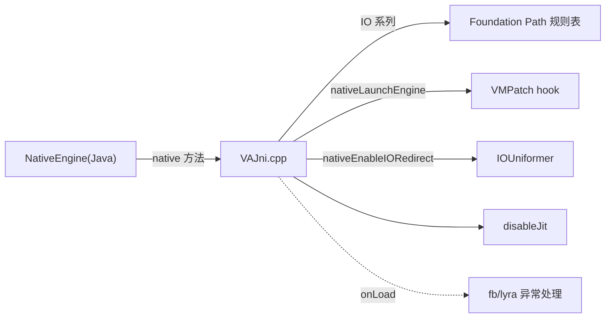

# native/Jni · JNI 桥接

::: tip 源码路径
[src/main/jni/Jni/](https://github.com/android-security-engineer/VirtualXposed-skills/tree/vxp/VirtualApp/lib/src/main/jni/Jni/)（`VAJni.cpp` + `VAJni.h` + `Helper.h`）
:::

`VAJni.cpp` 实现了 [`NativeEngine`](../client/native-engine) 声明的所有 `native` 方法，把 Java 调用转发到 Foundation 层。

## 方法映射

| NativeEngine native 方法 | VAJni 实现 |
| --- | --- |
| `nativeIORedirect(orig, new)` | 注册到 `Path` 规则表 |
| `nativeIOWhitelist(path)` | 加白名单 |
| `nativeIOForbid(path)` | 加禁止 |
| `nativeEnableIORedirect(soPath, api, preview)` | 调 `IOUniformer` 启动 hook |
| `nativeGetRedirectedPath(orig)` | 查规则做路径转换 |
| `nativeReverseRedirectedPath(redir)` | 反向路径转换 |
| `nativeLaunchEngine(methods, hostPkg, isArt, api, cameraType)` | 调 `VMPatch` hook 指定 native 方法 |
| `disableJit(api)` | 关闭 JIT |

`onLoad` 里通过 `fb/onload.cpp` 注册 lyra 异常处理，使 native 崩溃时生成可读堆栈。
## JNI 桥接调用链

