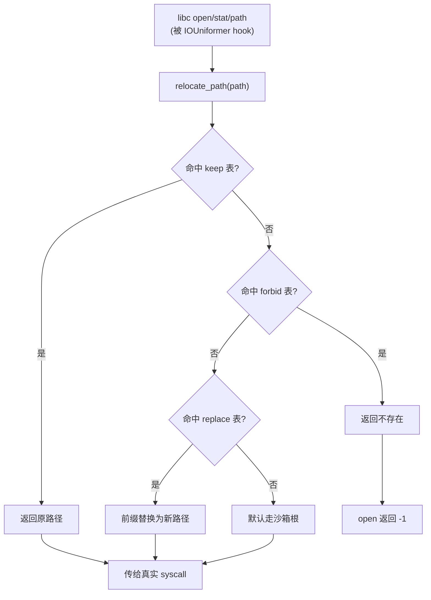

# native/Foundation/SandboxFs · 路径重定向引擎

::: tip 源码路径
[`src/main/jni/Foundation/SandboxFs.cpp`](https://github.com/android-security-engineer/VirtualXposed-skills/blob/vxp/VirtualApp/lib/src/main/jni/Foundation/SandboxFs.cpp)
:::

IO 重定向的路径计算核心，182 行。维护 keep（白名单）、forbid（禁止）、replace（替换）三张表，把虚拟 App 的文件路径透明映射到沙箱目录。被 [IOUniformer](./native-io-uniformer) 的 libc hook 调用。

## 三张路径表

| 表 | 添加 API | 作用 |
| --- | --- | --- |
| keep | `add_keep_item(path)` | 白名单，命中后**不重定向**，原样访问真实路径 |
| forbid | `add_forbidden_item(path)` | 禁止表，命中后返回不存在 |
| replace | `add_replace_item(orig, new)` | 替换表，把 orig 前缀替换为 new |

配套查询函数（从源码提取）：

| 函数 | 作用 |
| --- | --- |
| `relocate_path(_path, &result)` | 正向重定向：真实路径 → 沙箱路径 |
| `relocate_path_inplace(_path, size, &result)` | 原地改写 path 缓冲区 |
| `reverse_relocate_path(_path)` | 反向：沙箱路径 → 真实路径（供 App 回显） |
| `reverse_relocate_path_inplace(_path, size)` | 反向原地改写 |
| `match_path(is_folder, size, item_path, path)` | 前缀匹配判定（文件夹需带 `/`） |
| `get_keep_item_count()` / `get_forbidden_item_count()` / `get_replace_item_count()` | 各表条目数 |
| `get_keep_items()` / `get_forbidden_items()` / `get_replace_items()` | 取各表链表头 |

## 重定向决策

`relocate_path` 与 `reverse_relocate_path` 互为逆运算，保证 App 通过 `getAbsolutePath` 看到的仍是它期望的路径（如 `/data/data/<pkg>`），而真实文件落在沙箱内。

## 环境变量初始化

`IOUniformer::init_env_before_all` 读取的环境变量与三张表的对应：

| 环境变量 | 对应 API |
| --- | --- |
| `V_KEEP_ITEM_<n>` | `add_keep_item` |
| `V_FORBID_ITEM_<n>` | `add_forbidden_item` |
| `V_REPLACE_ITEM_SRC_<n>` + `V_REPLACE_ITEM_DST_<n>` | `add_replace_item` |

详见 [虚拟存储与 IO 重定向](../../features/io-redirect)。
