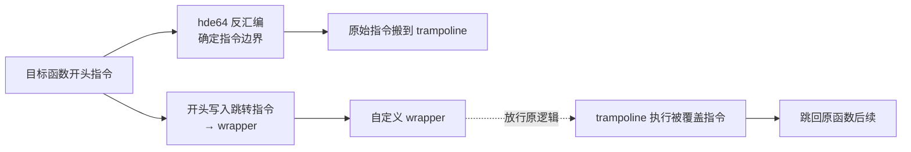

# native/Substrate · x86_64 inline hook

::: tip 源码路径
[`src/main/jni/Substrate/`](https://github.com/android-security-engineer/VirtualXposed-skills/tree/vxp/VirtualApp/lib/src/main/jni/Substrate)
:::

基于 CydiaSubstrate 的 inline hook 库，约 11 个文件，服务 x86_64 架构。

## 文件组成

| 文件 | 职责 |
| --- | --- |
| `SubstrateHook.cpp` / `.h` | inline hook 主实现：指令重写 + 跳转 |
| `SubstratePosixMemory.cpp` | 内存权限处理（`mprotect`） |
| `SubstrateDebug.cpp` / `.hpp` | 调试支持 |
| `hde64.c` / `.h` | 64 位指令反汇编（确定要复制的指令长度） |
| `SubstrateX86.hpp` | x86 专用 |
| `SubstrateARM.hpp` | ARM 专用（备选） |
| `Buffer.hpp` / `CydiaSubstrate.h` / `SubstrateLog.hpp` / `table64.h` | 辅助 |

## 工作原理

inline hook 把目标函数开头几条指令替换为跳转指令，跳到自己的 wrapper。x86_64 变长指令，需用 `hde64` 反汇编确定"刚好覆盖 N 字节"的指令边界，把被覆盖的原始指令搬到 trampoline 执行。

`IOUniformer`/`VMPatch` 在 x86_64 上调 SubstrateHook 改写 libc/ART 函数。
## x86_64 inline hook 原理

