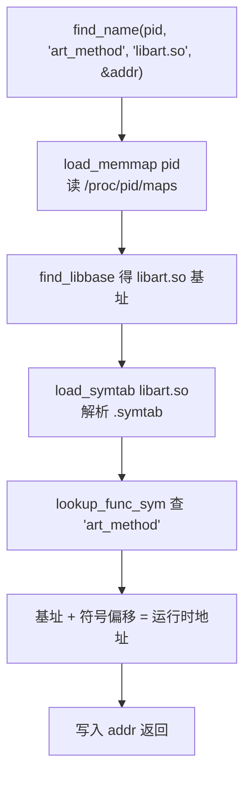

# native/Foundation/SymbolFinder · ELF 符号查找

::: tip 源码路径
[`src/main/jni/Foundation/SymbolFinder.cpp`](https://github.com/android-security-engineer/VirtualXposed-skills/blob/vxp/VirtualApp/lib/src/main/jni/Foundation/SymbolFinder.cpp)
:::

427 行。按进程 PID 解析 `/proc/<pid>/maps`，加载指定 so 的符号表，查找符号的**运行时地址**。与 [fake_dlfcn](./native-fake-dlfcn) 互补：fake_dlfcn 处理文件级 ELF，SymbolFinder 处理已加载 so 的运行时地址。

## 关键函数

从源码提取：

| 函数 | 作用 |
| --- | --- |
| `find_name(pid, name, libn, &addr)` | 在 pid 进程的 libn 中查找符号 name，写入 addr |
| `find_libbase(pid, libn, &addr)` | 查 libn 在 pid 进程的加载基址 |
| `load_symtab(filename)` | 加载 so 文件的符号表（`symtab_t`） |
| `load_memmap(pid, mm, &nmmp)` | 解析 `/proc/<pid>/maps`，得到各 so 的地址区间 |
| `lookup_sym(s, type, name, &val)` | 在符号表里按类型+名字查 |
| `lookup_func_sym(s, name, &val)` | 仅查 FUNC 类型符号 |
| `get_syms(fd, symh, strh)` | 从 ELF 的 section header 取符号表与字符串表 |

## 查找流程

## 与 fake_dlfcn 的分工

| 场景 | 用谁 |
| --- | --- |
| 取文件内符号偏移（文件未加载） | [fake_dlfcn](./native-fake-dlfcn) |
| 取已加载 so 的运行时地址（带 PID） | SymbolFinder |
| 符号已通过 linker 导出 | 系统 `dlsym` |

[VMPatch](./native-vm-patch) 用 SymbolFinder 定位 ART 的 `OpenDexFiles`、`CompileMethod` 等内部函数地址，再走 inline hook 替换。

## ELF 解析细节

`load_symtab` 解析 ELF 流程：

支持 32/64 位 ELF（通过 `Elf32_Shdr`/`Elf64_Shdr` 适配），`my_pread` 替代 `pread` 以兼容老内核。
