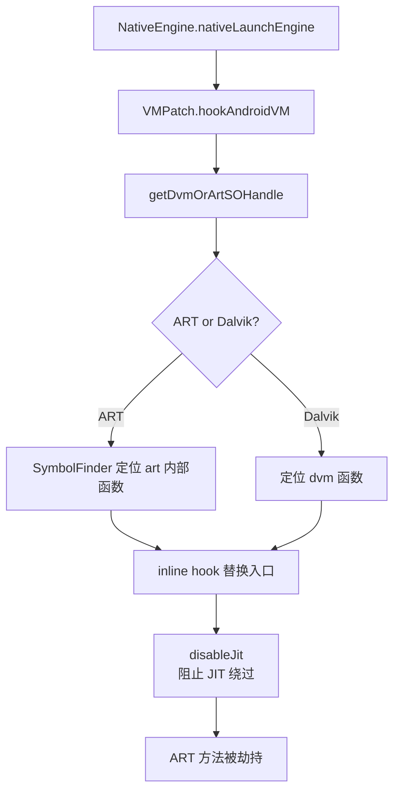

# native/Foundation/VMPatch · ART VM hook 入口

::: tip 源码路径
[`src/main/jni/Foundation/VMPatch.cpp`](https://github.com/android-security-engineer/VirtualXposed-skills/blob/vxp/VirtualApp/lib/src/main/jni/Foundation/VMPatch.cpp)
:::

510 行。native 层 hook ART 虚拟机的入口，定位 ART 内部函数（`OpenDexNativeFunc` 等）并替换，实现方法级 hook。由 [`NativeEngine.nativeLaunchEngine`](../client/native-engine) 触发。

## 关键函数

从源码提取：

| 函数 | 作用 |
| --- | --- |
| `hookAndroidVM(javaMethods, ...)` | 主入口：批量 hook ART 方法 |
| `getDvmOrArtSOHandle()` | 取 libdvm.so / libart.so 的 so 句柄 |
| `disableJit(apiLevel)` | 禁用 ART JIT，防止被 hook 的方法被 JIT 编译绕过 |
| `new_native_openDexNativeFunc(env, clazz, sourceName, ...)` | 替换 ART 的 dex 打开函数（旧版） |
| `new_native_openDexNativeFunc_N(env, clazz, sourceName, ...)` | 新版（API ≥ N） |
| `new_bridge_openDexNativeFunc(args, pResult, method, self)` | 桥接到新实现（快速解释器路径） |
| `getCallingUid(clazz)` | 获取调用方 UID（沙箱内 UID 映射） |

## hook 启动链

## disableJit 为何关键

ART 会把热点方法 JIT 编译成机器码直接执行，**绕过解释器的 hook 点**。若不禁用 JIT：

禁用 JIT 后所有方法走解释器，hook 才能稳定命中。这也是 [IOUniformer](./native-io-uniformer) 的 `execve` 拦截里给 dex2oat 注入 `--inline-max-code-units=0` 的同源目的——阻止内联。

## OpenDexNativeFunc 双版本

ART 的 dex 打开函数签名随版本变化：

| 版本 | 函数 | VMPatch 替换 |
| --- | --- | --- |
| API < N | `openDexFileNative(sourceName, ...)` | `new_native_openDexNativeFunc` |
| API ≥ N | `openDexFilesNativeOat(...)` | `new_native_openDexNativeFunc_N` |
| 快速解释器路径 | native bridge 入口 | `new_bridge_openDexNativeFunc` |

替换后，虚拟 App 加载 dex 时 VMPatch 介入，可记录/改写加载的 dex 路径，配合 [IOUniformer](./native-io-uniformer) 实现 dex 路径重定向。

详见 [Native 层](../../features/native-layer)。
