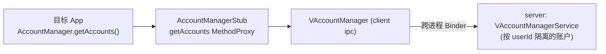

# account · 账户服务代理

::: tip 源码路径
[`src/main/java/com/lody/virtual/client/hook/proxies/account/AccountManagerStub.java`](https://github.com/android-security-engineer/VirtualXposed-skills/blob/vxp/VirtualApp/lib/src/main/java/com/lody/virtual/client/hook/proxies/account/AccountManagerStub.java)
:::

拦截 `AccountManager`（账户管理器），把目标 App 对系统账户的读写重定向到虚拟账户服务 `VAccountManagerService`。

## 拦截的服务

`Context.ACCOUNT_SERVICE`，通过 `mirror.android.accounts.IAccountManager.Stub.asInterface` 拿到系统 `IAccountManager` 的代理接口。

## 注入点

继承 `BinderInvocationProxy`，构造时把 `ServiceManager.sCache["account"]` 替换为携带本代理的动态代理 IBinder。

## 关键 MethodProxy

`AccountManagerStub` 在 `onBindMethods` 内联注册了约 30 个 MethodProxy，覆盖账户体系全部接口：

- **查询**：`getAccounts` / `getAccountsForPackage` / `getAccountsByTypeForPackage` / `getAccountsAsUser` / `hasFeatures` / `getAccountsByFeatures` / `getAuthenticatorTypes`
- **凭证读写**：`getPassword` / `setPassword` / `clearPassword` / `getUserData` / `setUserData` / `peekAuthToken` / `setAuthToken` / `invalidateAuthToken` / `getAuthToken` / `getAuthTokenLabel`
- **账户增删**：`addAccountExplicitly` / `removeAccount` / `removeAccountAsUser` / `removeAccountExplicitly` / `copyAccountToUser` / `addAccount` / `addAccountAsUser` / `updateCredentials` / `editProperties` / `confirmCredentialsAsUser` / `accountAuthenticated` / `addSharedAccountAsUser` / `getSharedAccountsAsUser`
- **权限**：`updateAppPermission`

## 与虚拟服务的关系

所有 MethodProxy 都委托给 `VAccountManager.get()`（客户端 IPC 代理），最终跨进程调用 server 的 [`VAccountManagerService`](../server/accounts)，让每个虚拟用户拥有独立的账户空间，互不污染真实系统账户。



## 拦截方法清单

从源码 `onBindMethods` / `@Inject` 内部类提取的 MethodProxy 拦截点：

```
- accountAuthenticated
- addAccount
- addAccountAsUser
- addAccountExplicitly
- addSharedAccountAsUser
- clearPassword
- confirmCredentialsAsUser
- copyAccountToUser
- editProperties
- getAccounts
- getAccountsAsUser
- getAccountsByFeatures
- getAccountsByTypeForPackage
- getAccountsForPackage
- getAuthToken
- getAuthTokenLabel
- getAuthenticatorTypes
- getPassword
- getPreviousName
- getSharedAccountsAsUser
- getUserData
- hasFeatures
- invalidateAuthToken
- peekAuthToken
- removeAccount
- removeAccountAsUser
- removeAccountExplicitly
- removeSharedAccountAsUser
- renameAccount
- renameSharedAccountAsUser
- setAccountVisibility
- setAuthToken
- setPassword
- setUserData
- updateAppPermission
- updateCredentials
```
