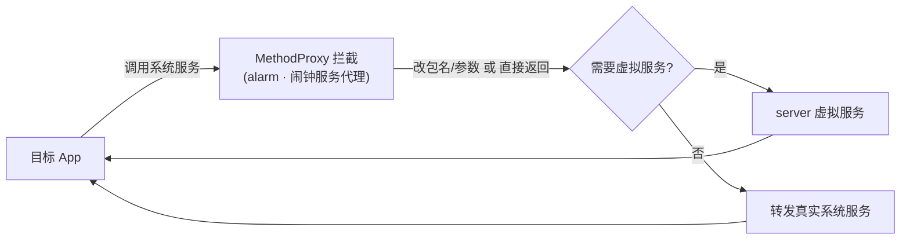

# alarm · 闹钟服务代理

::: tip 源码路径
[`src/main/java/com/lody/virtual/client/hook/proxies/alarm/AlarmManagerStub.java`](https://github.com/android-security-engineer/VirtualXposed-skills/blob/vxp/VirtualApp/lib/src/main/java/com/lody/virtual/client/hook/proxies/alarm/AlarmManagerStub.java)
:::

拦截 `AlarmManager`（闹钟/定时任务），把目标 App 注册的 `PendingIntent` 闹钟按虚拟 UID 归属，避免和真实系统闹钟混淆。

## 拦截的服务

`Context.ALARM_SERVICE`。

## 注入点

继承 `BinderInvocationProxy`，替换 `ServiceManager.sCache["alarm"]`。

## 关键行为

`AlarmManagerStub` 主要做调用方身份替换：把闹钟注册请求里的真实 callingUid 改写成虚拟 App 的 UID，使闹钟在系统层面归属宿主、但在虚拟环境里仍能正确回调到目标 App。这样多个虚拟 App 的闹钟互不串扰，且卸载虚拟 App 时能一并清理其闹钟。

## 与虚拟服务的关系

闹钟的注册/取消最终走真实系统的 `AlarmManager`（VirtualXposed 不在 server 重实现闹钟服务），仅靠参数改写实现隔离。


## 拦截方法清单

从源码 `onBindMethods` / `@Inject` 内部类提取的 MethodProxy 拦截点：

```
- set
- setTime
- setTimeZone
```

## 拦截与转发流程


