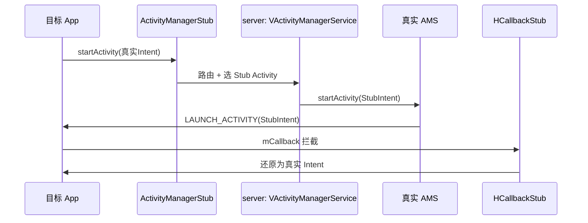

# am · 活动管理代理

::: tip 源码路径
[`src/main/java/com/lody/virtual/client/hook/proxies/am/`](https://github.com/android-security-engineer/VirtualXposed-skills/tree/vxp/VirtualApp/lib/src/main/java/com/lody/virtual/client/hook/proxies/am)
:::

拦截 `ActivityManager`（活动管理器）——这是 VirtualXposed 最核心、最庞大的代理之一，共 **5 个文件**、`MethodProxies.java` 里定义了 **50+ 个 MethodProxy**。

## 文件组成

| 文件 | 职责 |
| --- | --- |
| `ActivityManagerStub.java` | 主代理，拦截 `activity` 服务 |
| `ActivityTaskManagerStub.java` | Android 10+ 拆分出的 ATMS（ActivityTaskManager）服务代理 |
| `HCallbackStub.java` | Hook 主线程 `Handler`（`ActivityThread.mH`）的 `mCallback`，在 `LAUNCH_ACTIVITY` 等消息上还原真实 Intent（配合 [Stub Activity](../../features/stub-activity)） |
| `TransactionHandlerStub.java` | Android 9+ 用 `ClientTransaction` 机制驱动生命周期，这里 hook `TransactionExecutor` 改写 |
| `MethodProxies.java` | 50+ 个 MethodProxy 集合 |

## 关键 MethodProxy（节选）

`MethodProxies.java` 用 `@Inject` 注解批量注册：

- **Activity 启动**：`StartActivity` / `StartActivityAsUser` / `StartActivityAsCaller` / `StartActivityAndWait` / `StartActivityWithConfig` / `StartActivityIntentSender` / `StartVoiceActivity` / `StartActivities` / `StartNextMatchingActivity` / `OverridePendingTransition`
- **Activity 结束/调度**：`FinishActivity` / `SetTaskDescription` / `GetCallingActivity` / `GetCallingPackage` / `GetActivityClassForToken`
- **Service**：`StartService` / `StopService` / `BindService` / `BindIsolatedService` / `UnbindService` / `PublishService` / `ServiceDoneExecuting` / `StopServiceToken` / `PeekService` / `UnbindFinished`
- **Provider**：`GetContentProvider` / `GetContentProviderExternal` / `PublishContentProviders` / `ResolveContentProvider` / `UnstableProviderDied`
- **广播/接收器**：`BroadcastIntent` / `RegisterReceiver` / `RegisterReceiverWithFeature`（含 `IIntentReceiverProxy` 内部类代理接收器）
- **进程**：`GetRunningAppProcesses` / `GetPackageProcessState` / `KillApplicationProcess` / `ForceStopPackage` / `CrashApplication`
- **权限**：`CheckPermission` / `CheckGrantUriPermission` / `GrantUriPermissionFromOwner` / `GetPersistedUriPermissions` / `HandleIncomingUser`
- **IntentSender**：`GetIntentSender` / `GetIntentForIntentSender` / `GetIntentSenderWithFeature` / `GetPackageForIntentSender`
- **其他**：`GetTasks` / `GetCurrentUser` / `SetServiceForeground` / `UpdateDeviceOwner` / `AddPackageDependency` / `GetServices` / `GetPackageForToken`

## 与 Stub Activity / 虚拟 AMS 的配合



`StartActivity` 把真实 Intent 包进 Stub Intent 欺骗真实 AMS，`HCallbackStub` 在客户端还原——这是 [Stub Activity 机制](../../features/stub-activity) 的客户端半边。

## 拦截方法清单

从源码 `onBindMethods` / `@Inject` 内部类提取的 MethodProxy 拦截点：

```
- activityDestroyed
- activityResumed
- addPackageDependency
- bindIsolatedService
- bindService
- broadcastIntent
- checkGrantUriPermission
- checkPermission
- checkPermissionWithToken
- checkUriPermission
- crashApplication
- finishActivity
- forceStopPackage
- getActivityClassForToken
- getAppTasks
- getCallingActivity
- getCallingPackage
- getContentProvider
- getContentProviderExternal
- getCurrentUser
- getIntentForIntentSender
- getIntentSender
- getIntentSenderWithFeature
- getPackageAskScreenCompat
- getPackageForIntentSender
- getPackageForToken
- getPackageProcessState
- getPersistedUriPermissions
- getRecentTasks
- getRunningAppProcesses
- getRunningTasks
- getServices
- getTasks
- grantUriPermissionFromOwner
- handleIncomingUser
- isUserRunning
- killApplicationProcess
- navigateUpTo
- overridePendingTransition
- peekService
- publishContentProviders
- publishService
- registerReceiver
- registerReceiverWithFeature
- serviceDoneExecuting
- setAppLockedVerifying
- setPackageAskScreenCompat
- setServiceForeground
- setTaskDescription
- startActivities
- startActivity
- startActivityAndWait
- startActivityAsCaller
- startActivityAsUser
- startActivityIntentSender
- startActivityWithConfig
- startNextMatchingActivity
- startService
- startVoiceActivity
- stopService
- stopServiceToken
- unbindFinished
- unbindService
- unstableProviderDied
- updateConfiguration
- updateDeviceOwner
```
