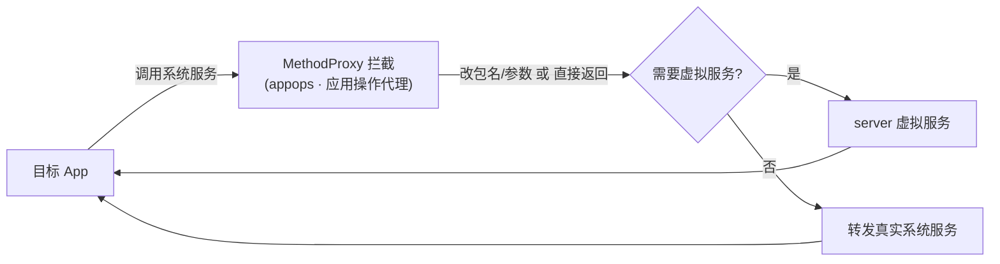

# appops · 应用操作代理

::: tip 源码路径
[`src/main/java/com/lody/virtual/client/hook/proxies/appops/AppOpsManagerStub.java`](https://github.com/android-security-engineer/VirtualXposed-skills/blob/vxp/VirtualApp/lib/src/main/java/com/lody/virtual/client/hook/proxies/appops/AppOpsManagerStub.java)
:::

拦截 `AppOpsManager`（应用操作记录/权限管控，如"是否允许后台定位"）。把目标 App 的 `checkOp`/`noteOp` 的 callingUid/包名改写为虚拟身份，使系统 AppOps 统计归属虚拟 App 而非宿主。

## 拦截的服务

`Context.APP_OPS_SERVICE`，继承 `BinderInvocationProxy` 替换 `ServiceManager.sCache["appops"]`。

## 关键行为

主要靠 `ReplaceCallingPkgMethodProxy` / UID 改写类 MethodProxy，把操作记录里的 `uid`、`packageName` 替换为虚拟值。VirtualXposed 未在 server 重实现 AppOps，沿用真实系统但隔离身份。


## 拦截方法清单

从源码 `onBindMethods` / `@Inject` 内部类提取的 MethodProxy 拦截点：

```
- checkAudioOperation
- checkOperation
- checkPackage
- finishOperation
- getOpsForPackage
- noteOperation
- noteProxyOperation
- resetAllModes
- setAudioRestriction
- setMode
- startOperation
- startWatchingMode
```

## 拦截与转发流程


