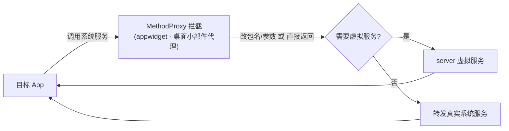

# appwidget · 桌面小部件代理

::: tip 源码路径
[`src/main/java/com/lody/virtual/client/hook/proxies/appwidget/AppWidgetManagerStub.java`](https://github.com/android-security-engineer/VirtualXposed-skills/blob/vxp/VirtualApp/lib/src/main/java/com/lody/virtual/client/hook/proxies/appwidget/AppWidgetManagerStub.java)
:::

拦截 `AppWidgetManager`（桌面小部件）。把目标 App 注册小部件时的 callingUid/包名替换为虚拟身份，避免小部件注册到真实系统桌面时身份错乱。

## 拦截的服务

`Context.APPWIDGET_SERVICE`，继承 `BinderInvocationProxy`。

## 关键行为

主要做 callingUid / packageName 的参数改写，使小部件 ID 分配与虚拟 App 对应。VirtualXposed 不重实现 widget 服务，靠身份隔离。


## 拦截方法清单

从源码 `onBindMethods` / `@Inject` 内部类提取的 MethodProxy 拦截点：

```
- allocateAppWidgetId
- bindAppWidgetId
- bindRemoteViewsService
- createAppWidgetConfigIntentSender
- deleteAllHosts
- deleteAppWidgetId
- deleteHost
- getAppWidgetIds
- getAppWidgetIdsForHost
- getAppWidgetInfo
- getAppWidgetOptions
- getAppWidgetViews
- getInstalledProvidersForProfile
- hasBindAppWidgetPermission
- isBoundWidgetPackage
- notifyAppWidgetViewDataChanged
- partiallyUpdateAppWidgetIds
- setBindAppWidgetPermission
- startListening
- stopListening
- unbindRemoteViewsService
- updateAppWidgetIds
- updateAppWidgetOptions
- updateAppWidgetProvider
```

## 拦截与转发流程


