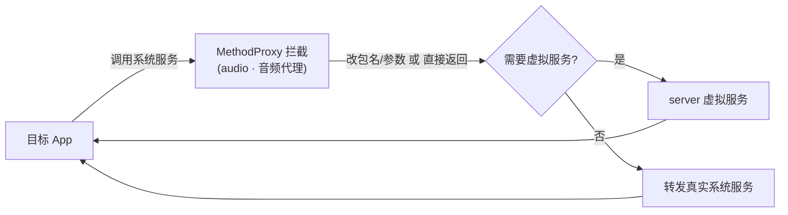

# audio · 音频代理

::: tip 源码路径
[`src/main/java/com/lody/virtual/client/hook/proxies/audio/AudioManagerStub.java`](https://github.com/android-security-engineer/VirtualXposed-skills/blob/vxp/VirtualApp/lib/src/main/java/com/lody/virtual/client/hook/proxies/audio/AudioManagerStub.java)
:::

拦截 `AudioManager`（音量/铃声/音频焦点）。把音频焦点请求、铃声查询等调用的 callingUid 替换为虚拟 UID，让虚拟 App 的音频焦点管理在虚拟身份下进行。

## 拦截的服务

`Context.AUDIO_SERVICE`，继承 `BinderInvocationProxy`。

## 关键行为

UID/包名参数改写为主，配合 `VClientImpl` 的音频权限伪装（native 层 `AudioRecord.native_check_permission` 由 `VMPatch` 处理，见 [Native 层](../../features/native-layer)）。


## 拦截方法清单

从源码 `onBindMethods` / `@Inject` 内部类提取的 MethodProxy 拦截点：

```
- abandonAudioFocus
- adjustLocalOrRemoteStreamVolume
- adjustMasterVolume
- adjustStreamVolume
- adjustSuggestedStreamVolume
- adjustVolume
- avrcpSupportsAbsoluteVolume
- disableSafeMediaVolume
- registerRemoteControlClient
- requestAudioFocus
- setBluetoothScoOn
- setMasterVolume
- setMicrophoneMute
- setMode
- setRingerModeExternal
- setRingerModeInternal
- setSpeakerphoneOn
- setStreamVolume
- setWiredDeviceConnectionState
- startBluetoothSco
- stopBluetoothSco
- unregisterAudioFocusClient
```

## 拦截与转发流程


