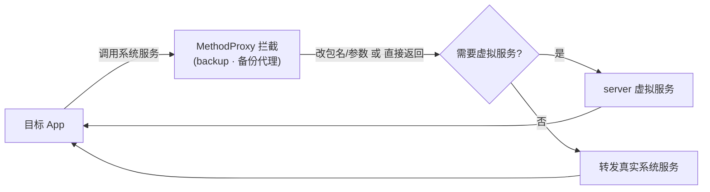

# backup · 备份代理

::: tip 源码路径
[`src/main/java/com/lody/virtual/client/hook/proxies/backup/BackupManagerStub.java`](https://github.com/android-security-engineer/VirtualXposed-skills/blob/vxp/VirtualApp/lib/src/main/java/com/lody/virtual/client/hook/proxies/backup/BackupManagerStub.java)
:::

拦截 `BackupManager`（系统备份/恢复服务）。替换 `ServiceManager.sCache["backup"]`，阻止或改写目标 App 对系统备份服务的调用，避免虚拟 App 触发真实系统备份。

## 拦截的服务

`"backup"`（字符串服务名），继承 `BinderInvocationProxy`。

## 关键行为

以调用拦截/短路为主，VirtualXposed 不在 server 重实现备份服务。


## 拦截方法清单

从源码 `onBindMethods` / `@Inject` 内部类提取的 MethodProxy 拦截点：

```
- acknowledgeFullBackupOrRestore
- agentConnected
- agentDisconnected
- backupNow
- beginRestoreSession
- clearBackupData
- dataChanged
- fullBackup
- fullRestore
- fullTransportBackup
- getCurrentTransport
- hasBackupPassword
- isBackupEnabled
- listAllTransports
- restoreAtInstall
- selectBackupTransport
- setBackupEnabled
- setBackupPassword
- setBackupProvisioned
```

## 拦截与转发流程


