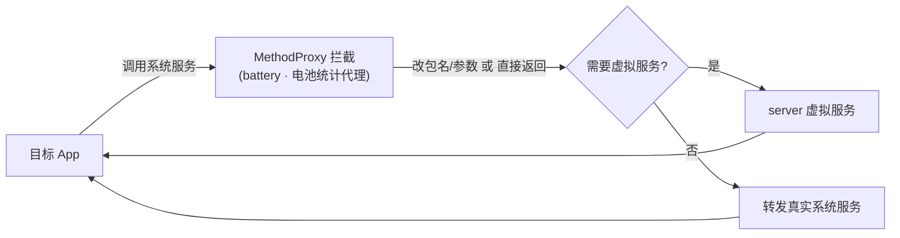

# battery · 电池统计代理

::: tip 源码路径
[`src/main/java/com/lody/virtual/client/hook/proxies/battery/BatteryStatsStub.java`](https://github.com/android-security-engineer/VirtualXposed-skills/blob/vxp/VirtualApp/lib/src/main/java/com/lody/virtual/client/hook/proxies/battery/BatteryStatsStub.java)
:::

拦截 `BatteryStats`（电池统计服务）。替换 `ServiceManager.sCache["batterystats"]`，改写目标 App 查询电池统计时的 callingUid，使其归属虚拟身份。

## 拦截的服务

`"batterystats"`，继承 `BinderInvocationProxy`。

## 关键行为

UID 改写为主，VirtualXposed 不重实现电池统计。


## 拦截方法清单

从源码 `onBindMethods` / `@Inject` 内部类提取的 MethodProxy 拦截点：

```
- takeUidSnapshot
```

## 拦截与转发流程


