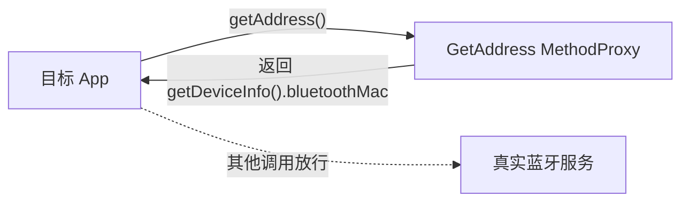

# bluetooth · 蓝牙代理

::: tip 源码路径
[`src/main/java/com/lody/virtual/client/hook/proxies/bluetooth/BluetoothStub.java`](https://github.com/android-security-engineer/VirtualXposed-skills/blob/vxp/VirtualApp/lib/src/main/java/com/lody/virtual/client/hook/proxies/bluetooth/BluetoothStub.java)
:::

拦截蓝牙相关系统服务。替换 `ServiceManager.sCache["bluetooth"]`，拦截 `getAddress` 返回伪造的蓝牙 MAC 地址，隔离虚拟 App 的蓝牙设备身份。

## 拦截的服务

`"bluetooth"`（SDK≥17 为 `"bluetooth_manager"`），继承 `BinderInvocationProxy`。

## 关键行为

核心是 `getAddress` 的固定返回代理——`call` 阶段直接返回 `getDeviceInfo().bluetoothMac`（来自 [`VDeviceInfo`](../remote/vdevice-info) 的伪造 MAC），不走真实蓝牙协议栈。其余调用放行原服务。标有 `@FakeDeviceMark("fake MAC")`。

## 拦截方法清单

从源码 `onBindMethods` / `@Inject` 内部类提取的 MethodProxy 拦截点：

```
- getAddress
```

## 拦截与转发流程


