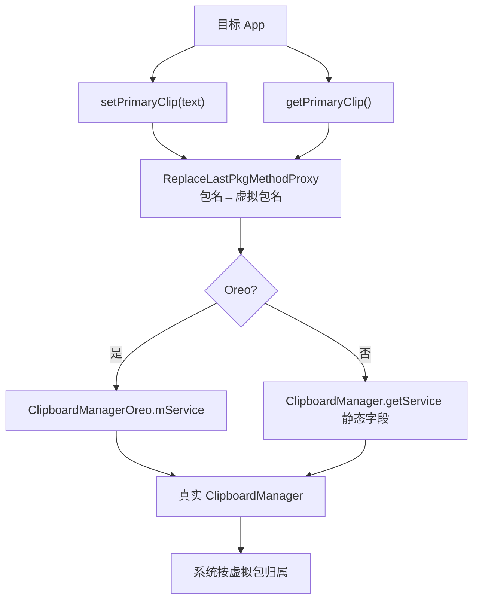

# clipboard · 剪贴板代理

::: tip 源码路径
[`src/main/java/com/lody/virtual/client/hook/proxies/clipboard/ClipBoardStub.java`](https://github.com/android-security-engineer/VirtualXposed-skills/blob/vxp/VirtualApp/lib/src/main/java/com/lody/virtual/client/hook/proxies/clipboard/ClipBoardStub.java)
:::

拦截 `ClipboardManager`（剪贴板）。把目标 App 读写剪贴板时的包名替换为虚拟包名，并处理 Android 8.0（Oreo）剪贴板 API 变更。

## 拦截的服务

`Context.CLIPBOARD_SERVICE`，继承 `BinderInvocationProxy`。

## 关键行为

- 用 `ReplaceLastPkgMethodProxy` 改写 `getPrimaryClip`/`setPrimaryClip`/`getPrimaryClipDescription`/`hasPrimaryClip`/`addPrimaryClipChangedListener`/`removePrimaryClipChangedListener`/`hasClipboardText` 的最后一个包名参数。
- **版本适配**：`getInterface()` 区分 Oreo 前后——Oreo 后从 `ClipboardManagerOreo.mService` 取系统服务，Oreo 前从 `ClipboardManager.getService` 静态字段取。
- `inject()` 不只替换 `sCache`，还把系统 `ClipboardManager` 实例的 `mService` 字段改写为代理接口（兼容部分版本绕过 sCache 直接持有的情况）。
- `isOreo()` 兼容三星设备特殊处理（`DeviceUtil.isSamsung()`）。

## 与虚拟服务的关系

剪贴板沿用真实系统，仅靠包名改写让系统把剪贴板操作归属到虚拟包，避免目标 App 的剪贴板内容暴露真实包名。


## 拦截方法清单

从源码 `onBindMethods` / `@Inject` 内部类提取的 MethodProxy 拦截点：

```
- addPrimaryClipChangedListener
- getPrimaryClip
- getPrimaryClipDescription
- hasClipboardText
- hasPrimaryClip
- removePrimaryClipChangedListener
- setPrimaryClip
```

## 拦截与转发流程



剪贴板沿用真实系统，仅改包名让操作归属虚拟包——不建虚拟剪贴板服务，避免内容双份。
