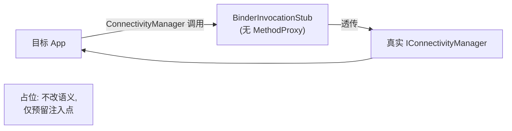

# connectivity · 网络连接代理

::: tip 源码路径
[`src/main/java/com/lody/virtual/client/hook/proxies/connectivity/ConnectivityStub.java`](https://github.com/android-security-engineer/VirtualXposed-skills/blob/vxp/VirtualApp/lib/src/main/java/com/lody/virtual/client/hook/proxies/connectivity/ConnectivityStub.java)
:::

拦截 `ConnectivityManager`（网络连接状态）。替换 `ServiceManager.sCache["connectivity"]`，但 `onBindMethods` 为空——**不拦截任何具体方法**，仅占据 binder 槽位。

## 拦截的服务

`Context.CONNECTIVITY_SERVICE`，继承 `BinderInvocationProxy`。

## 关键行为

本代理是"占位型"代理：构造时把 `BinderInvocationStub` 写入 `sCache["connectivity"]`，但未注册任何 `MethodProxy`。所有 `ConnectivityManager` 调用经动态代理透传到真实 `IConnectivityManager`，行为不变。占位的目的是为后续版本扩展预留注入点，并保持 45 个服务代理的结构一致。

## 拦截与转发流程

