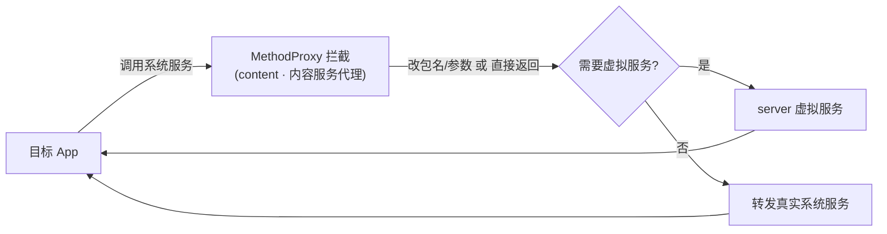

# content · 内容服务代理

::: tip 源码路径
[src/main/java/com/lody/virtual/client/hook/proxies/content/](https://github.com/android-security-engineer/VirtualXposed-skills/tree/vxp/VirtualApp/lib/src/main/java/com/lody/virtual/client/hook/proxies/content/)（`ContentServiceStub.java` + `MethodProxies.java`）
:::

拦截 `ContentService`（ContentObserver 全局通知服务）。替换 `ServiceManager.sCache["content"]`，改写 `notifyChange` 的 callingUid/包名，使内容变更通知在虚拟身份下发出。

## 拦截的服务

`"content"`，继承 `BinderInvocationProxy`。

## 关键 MethodProxy

`MethodProxies.java` 定义 `NotifyChange`——把 `notifyChange` 调用里的包名参数替换为虚拟包名，保证 ContentObserver 通知链不泄露真实身份。

## 与虚拟服务的关系

ContentService 沿用真实系统，仅靠身份改写隔离。


## 拦截方法清单

从源码 `onBindMethods` / `@Inject` 内部类提取的 MethodProxy 拦截点：

```
- notifyChange
```

## 拦截与转发流程


