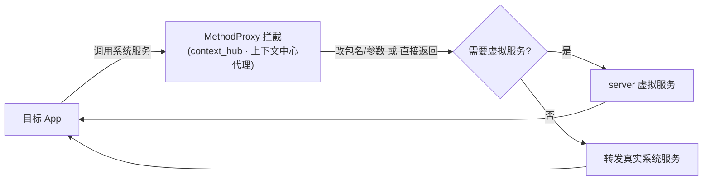

# context_hub · 上下文中心代理

::: tip 源码路径
[`src/main/java/com/lody/virtual/client/hook/proxies/context_hub/ContextHubServiceStub.java`](https://github.com/android-security-engineer/VirtualXposed-skills/blob/vxp/VirtualApp/lib/src/main/java/com/lody/virtual/client/hook/proxies/context_hub/ContextHubServiceStub.java)
:::

拦截 `ContextHubService`（硬件上下文中心，用于低功耗感知）。替换 `ServiceManager.sCache["contexthub"]`，短路或改写目标 App 对该硬件服务的调用。

## 拦截的服务

`"contexthub"`，继承 `BinderInvocationProxy`。

## 关键行为

以调用拦截为主，VirtualXposed 不重实现硬件上下文中心。


## 拦截方法清单

从源码 `onBindMethods` / `@Inject` 内部类提取的 MethodProxy 拦截点：

```
- registerCallback
```

## 拦截与转发流程


