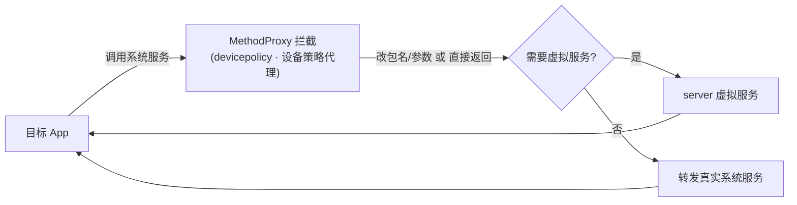

# devicepolicy · 设备策略代理

::: tip 源码路径
[`src/main/java/com/lody/virtual/client/hook/proxies/devicepolicy/DevicePolicyManagerStub.java`](https://github.com/android-security-engineer/VirtualXposed-skills/blob/vxp/VirtualApp/lib/src/main/java/com/lody/virtual/client/hook/proxies/devicepolicy/DevicePolicyManagerStub.java)
:::

拦截 `DevicePolicyManager`（设备管理器/MDM）。替换 `ServiceManager.sCache["device_policy"]`，短路目标 App 对设备策略的调用（如锁屏、擦除、密码策略），避免虚拟 App 干扰真实设备策略。

## 拦截的服务

`Context.DEVICE_POLICY_SERVICE`，继承 `BinderInvocationProxy`。

## 关键行为

以调用拦截/短路为主，VirtualXposed 不重实现设备策略服务。


## 拦截方法清单

从源码 `onBindMethods` / `@Inject` 内部类提取的 MethodProxy 拦截点：

```
- getStorageEncryptionStatus
```

## 拦截与转发流程


