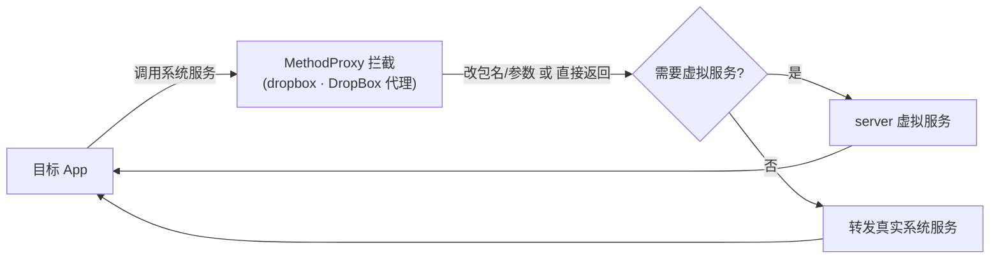

# dropbox · DropBox 代理

::: tip 码路径
[`src/main/java/com/lody/virtual/client/hook/proxies/dropbox/DropBoxManagerStub.java`](https://github.com/android-security-engineer/VirtualXposed-skills/blob/vxp/VirtualApp/lib/src/main/java/com/lody/virtual/client/hook/proxies/dropbox/DropBoxManagerStub.java)
:::

拦截 `DropBoxManager`（系统日志收集箱）。替换 `ServiceManager.sCache["dropbox"]`，改写 `addText`/`addData` 的 callingUid/包名，使虚拟 App 的日志条目归属虚拟身份。

## 拦截的服务

`Context.DROPBOX_SERVICE`，继承 `BinderInvocationProxy`。

## 关键行为

UID/包名参数改写为主，VirtualXposed 不重实现 DropBox。


## 拦截方法清单

从源码 `onBindMethods` / `@Inject` 内部类提取的 MethodProxy 拦截点：

```
- getNextEntry
```

## 拦截与转发流程


