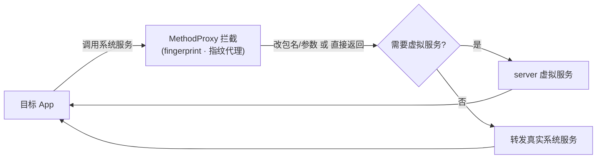

# fingerprint · 指纹代理

::: tip 源码路径
[`src/main/java/com/lody/virtual/client/hook/proxies/fingerprint/FingerprintManagerStub.java`](https://github.com/android-security-engineer/VirtualXposed-skills/blob/vxp/VirtualApp/lib/src/main/java/com/lody/virtual/client/hook/proxies/fingerprint/FingerprintManagerStub.java)
:::

拦截 `FingerprintManager`（指纹识别）。替换 `ServiceManager.sCache["fingerprint"]`，改写指纹认证调用的 callingUid/包名。

## 拦截的服务

`Context.FINGERPRINT_SERVICE`，继承 `BinderInvocationProxy`。

## 关键行为

UID/包名参数改写为主，VirtualXposed 不重实现指纹服务（沿用真实系统硬件）。


## 拦截方法清单

从源码 `onBindMethods` / `@Inject` 内部类提取的 MethodProxy 拦截点：

```
- authenticate
- cancelAuthentication
- getAuthenticatorId
- getEnrolledFingerprints
- hasEnrolledFingerprints
- isHardwareDetected
```

## 拦截与转发流程


