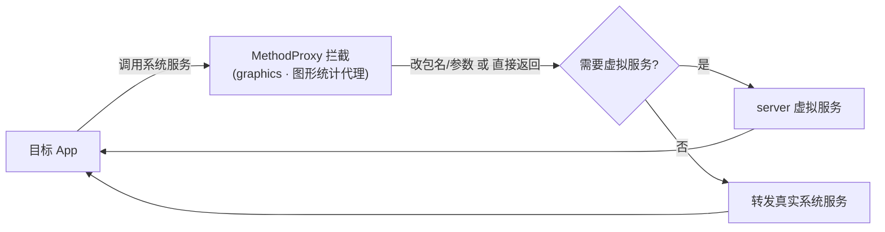

# graphics · 图形统计代理

::: tip 源码路径
[`src/main/java/com/lody/virtual/client/hook/proxies/graphics/GraphicsStatsStub.java`](https://github.com/android-security-engineer/VirtualXposed-skills/blob/vxp/VirtualApp/lib/src/main/java/com/lody/virtual/client/hook/proxies/graphics/GraphicsStatsStub.java)
:::

拦截 `GraphicsStats`（图形性能统计服务）。替换 `ServiceManager.sCache["graphicsstats"]`，改写统计调用的 callingUid/包名。

## 拦截的服务

`"graphicsstats"`，继承 `BinderInvocationProxy`。

## 关键行为

UID/包名参数改写为主，VirtualXposed 不重实现图形统计服务。


## 拦截方法清单

从源码 `onBindMethods` / `@Inject` 内部类提取的 MethodProxy 拦截点：

```
- requestBufferForProcess
```

## 拦截与转发流程


