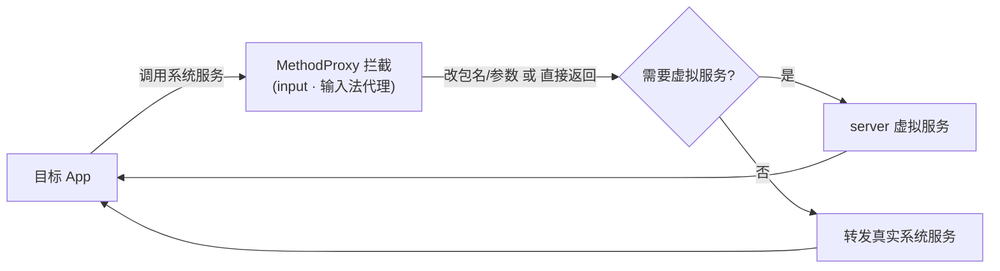

# input · 输入法代理

::: tip 源码路径
[src/main/java/com/lody/virtual/client/hook/proxies/input/](https://github.com/android-security-engineer/VirtualXposed-skills/tree/vxp/VirtualApp/lib/src/main/java/com/lody/virtual/client/hook/proxies/input/)（`InputMethodManagerStub.java` + `MethodProxies.java`）
:::

拦截 `InputMethodManager`（输入法管理）。替换 `ServiceManager.sCache["input_method"]`，改写输入法会话的 callingUid/包名/窗口焦点。

## 拦截的服务

`Context.INPUT_METHOD_SERVICE`，继承 `BinderInvocationProxy`。

## 关键 MethodProxy

`MethodProxies.java` 定义：

- `StartInput` — 输入法会话启动，改写 callingUid
- `WindowGainedFocus` — 窗口获得焦点时改写包名
- `StartInputOrWindowGainedFocus` — 合并版本

## 关键行为

让输入法系统服务把目标 App 的输入会话归属到虚拟包，避免输入法和真实包名绑定错乱。


## 拦截方法清单

从源码 `onBindMethods` / `@Inject` 内部类提取的 MethodProxy 拦截点：

```
- startInput
- startInputOrWindowGainedFocus
- windowGainedFocus
```

## 拦截与转发流程


