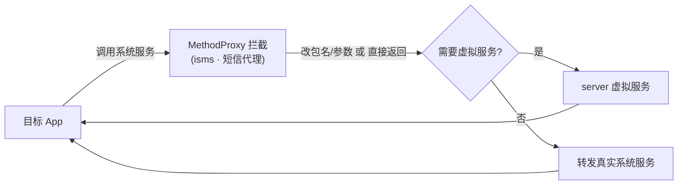

# isms · 短信代理

::: tip 源码路径
[`src/main/java/com/lody/virtual/client/hook/proxies/isms/ISmsStub.java`](https://github.com/android-security-engineer/VirtualXposed-skills/blob/vxp/VirtualApp/lib/src/main/java/com/lody/virtual/client/hook/proxies/isms/ISmsStub.java)
:::

拦截 `IccSmsInterfaceManager`（短信收发服务）。替换 `ServiceManager.sCache["isms"]`，改写短信调用的 callingUid/包名/订阅 ID。

## 拦截的服务

`"isms"`，继承 `BinderInvocationProxy`。

## 关键行为

UID/包名参数改写为主，VirtualXposed 不重实现短信服务（沿用真实系统，仅隔离身份）。


## 拦截方法清单

从源码 `onBindMethods` / `@Inject` 内部类提取的 MethodProxy 拦截点：

```
- copyMessageToIccEf
- copyMessageToIccEfForSubscriber
- getAllMessagesFromIccEf
- getAllMessagesFromIccEfForSubscriber
- sendData
- sendDataForSubscriber
- sendDataForSubscriberWithSelfPermissions
- sendMultipartText
- sendMultipartTextForSubscriber
- sendStoredMultipartText
- sendStoredText
- sendText
- sendTextForSubscriber
- sendTextForSubscriberWithSelfPermissions
- updateMessageOnIccEf
- updateMessageOnIccEfForSubscriber
```

## 拦截与转发流程


