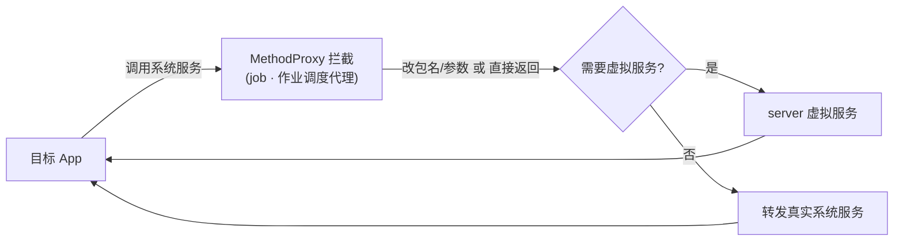

# job · 作业调度代理

::: tip 源码路径
[`src/main/java/com/lody/virtual/client/hook/proxies/job/JobServiceStub.java`](https://github.com/android-security-engineer/VirtualXposed-skills/blob/vxp/VirtualApp/lib/src/main/java/com/lody/virtual/client/hook/proxies/job/JobServiceStub.java)
:::

拦截 `JobScheduler`（后台作业调度）。把目标 App 注册的 Job 重定向到虚拟作业服务 `VJobSchedulerService`，让每个虚拟 App 有独立的作业队列。

## 拦截的服务

`Context.JOB_SCHEDULER_SERVICE`，继承 `BinderInvocationProxy`。

## 与虚拟服务的关系

不同于多数仅做身份改写的代理，job 代理把调用转发到 server 的 [`VJobSchedulerService`](../server/job)，在虚拟环境内重实现作业调度——这样虚拟 App 卸载时其作业一并清理，且不污染真实系统 JobScheduler。


## 拦截方法清单

从源码 `onBindMethods` / `@Inject` 内部类提取的 MethodProxy 拦截点：

```
- cancel
- cancelAll
- enqueue
- getAllPendingJobs
- getPendingJob
- schedule
```

## 拦截与转发流程


