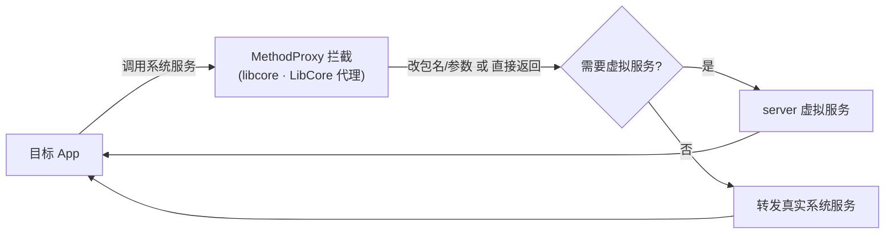

# libcore · LibCore 代理

::: tip 源码路径
[src/main/java/com/lody/virtual/client/hook/proxies/libcore/](https://github.com/android-security-engineer/VirtualXposed-skills/tree/vxp/VirtualApp/lib/src/main/java/com/lody/virtual/client/hook/proxies/libcore/)（`LibCoreStub.java` + `MethodProxies.java`）
:::

拦截 `libcore.io`（底层 IO/系统调用桥）。这个代理比较特殊——它 hook 的是 Java 层对 native 系统调用的封装，用于辅助 [IO 重定向](../../features/io-redirect) 的 Java 侧。

## 拦截的服务

`"chown"` 等，继承 `BinderInvocationProxy`。

## 关键 MethodProxy

`MethodProxies.java` 定义 5 个：

- `Lstat` — `lstat` 文件状态查询，路径转换
- `Stat` — `stat` 文件状态查询，路径转换
- `Getpwnam` — `getpwnam` 按用户名查 passwd，UID 映射
- `GetUid` — 获取 UID，返回虚拟 UID
- `GetsockoptUcred` — socket 选项取对端凭证，UID 映射

## 关键行为

与 native 层 `IOUniformer` 互补：native hook 拦 libc 的 `open`/`stat`，这里拦 Java 侧 `Libcore.os` 封装，双重保障路径重定向和 UID 映射生效。


## 拦截方法清单

从源码 `onBindMethods` / `@Inject` 内部类提取的 MethodProxy 拦截点：

```
- chown
- fchown
- getpwnam
- getpwuid
- getsockoptUcred
- getuid
- lchown
- lstat
- setuid
- stat
```

## 拦截与转发流程


