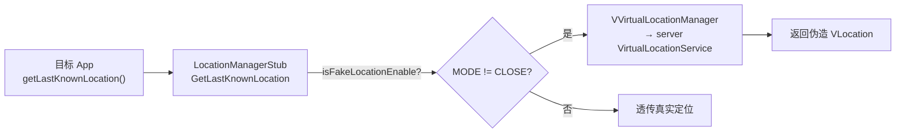

# location · 定位代理

::: tip 源码路径
[`src/main/java/com/lody/virtual/client/hook/proxies/location/`](https://github.com/android-security-engineer/VirtualXposed-skills/tree/vxp/VirtualApp/lib/src/main/java/com/lody/virtual/client/hook/proxies/location)（5 个文件）
:::

拦截 `LocationManager`（定位服务）——核心代理之一，实现 [虚拟定位](../../features/virtual-location)。共 5 个文件、17 个 MethodProxy。

## 文件组成

| 文件 | 职责 |
| --- | --- |
| `LocationManagerStub.java` | 主代理，替换 `ServiceManager.sCache["location"]` |
| `MethodProxies.java` | 17 个 MethodProxy 集合 |
| `MockLocationHelper.java` | 模拟定位辅助（构造伪造 Location 对象、按坐标回调 listener） |
| `GPSListenerThread.java` | 模拟 GPS 状态/NMEA 数据的监听线程 |
| `GPSStatusListenerThread.java` | GPS 状态变化监听线程 |

## 关键 MethodProxy

- **位置查询**：`GetLastLocation` / `GetLastKnownLocation` / `getProviders` / `getAllProviders` / `GetBestProvider` / `IsProviderEnabled` / `getProviderProperties`
- **更新注册**：`RequestLocationUpdates` / `RemoveUpdates`
- **GPS 状态**：`AddGpsStatusListener` / `RemoveGpsStatusListener` / `RegisterGnssStatusCallback` / `UnregisterGnssStatusCallback`
- **其他**：`sendExtraCommand` / `locationCallbackFinished`

## 与虚拟服务的关系



`MODE_CLOSE` 时透传真实定位，否则转发到 server 的 `VirtualLocationService` 返回伪造坐标。

## 拦截方法清单

从源码 `onBindMethods` / `@Inject` 内部类提取的 MethodProxy 拦截点：

```
- addGpsMeasurementsListener
- addGpsNavigationMessageListener
- addGpsStatusListener
- addNmeaListener
- addProximityAlert
- addTestProvider
- clearTestProviderEnabled
- clearTestProviderLocation
- clearTestProviderStatus
- getAllProviders
- getBestProvider
- getLastKnownLocation
- getLastLocation
- getProviderProperties
- getProviders
- isProviderEnabled
- locationCallbackFinished
- registerGnssStatusCallback
- removeGeofence
- removeGpsMeasurementListener
- removeGpsNavigationMessageListener
- removeGpsStatusListener
- removeNmeaListener
- removeTestProvider
- removeUpdates
- requestGeofence
- requestLocationUpdates
- sendExtraCommand
- setTestProviderEnabled
- setTestProviderLocation
- setTestProviderStatus
- unregisterGnssStatusCallback
```
