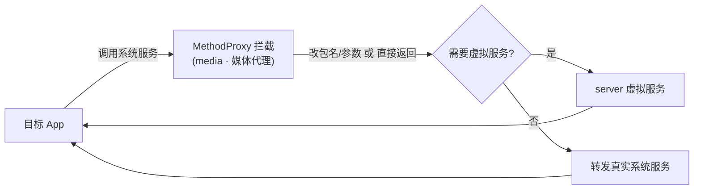

# media · 媒体代理

::: tip 源码路径
[src/main/java/com/lody/virtual/client/hook/proxies/media/](https://github.com/android-security-engineer/VirtualXposed-skills/tree/vxp/VirtualApp/lib/src/main/java/com/lody/virtual/client/hook/proxies/media/)（`router/` + `session/` 两个子目录）
:::

拦截媒体相关系统服务，分两个子代理：

## 子代理

| 子目录 | 拦截服务 | 职责 |
| --- | --- | --- |
| `router/` | `media_router` | `MediaRouter`（媒体路由，投屏/音频输出设备选择），改写 callingUid/包名 |
| `session/` | `media_session` | `MediaSessionManager`（媒体会话，通知栏播放控制），改写 callingUid/包名 |

## 关键行为

两者均继承 `BinderInvocationProxy`，各拦一个方法改写调用方包名，VirtualXposed 不重实现媒体路由/会话服务，沿用真实系统但隔离身份。

## 拦截方法清单

从两个子代理源码提取：

| 子代理 | 拦截方法 | 改写 |
| --- | --- | --- |
| `MediaRouterServiceStub` | `registerClientAsUser` | callingPkg |
| `SessionManagerStub` | `createSession` | callingPkg |

均用 `ReplaceCallingPkgMethodProxy`，把调用方包名替换为虚拟包名后放行原方法。

## 拦截与转发流程

