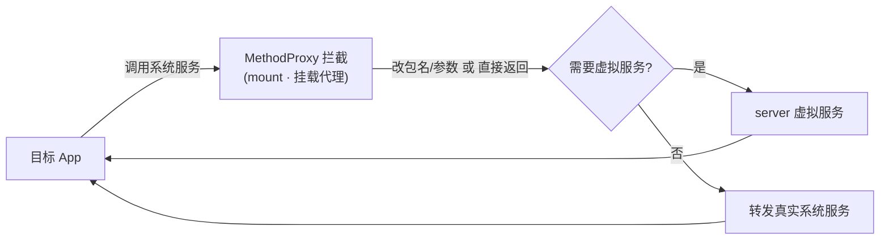

# mount · 挂载代理

::: tip 源码路径
[src/main/java/com/lody/virtual/client/hook/proxies/mount/](https://github.com/android-security-engineer/VirtualXposed-skills/tree/vxp/VirtualApp/lib/src/main/java/com/lody/virtual/client/hook/proxies/mount/)（`MountServiceStub.java` + `MethodProxies.java`）
:::

拦截 `IMountService`（存储挂载服务）。替换 `ServiceManager.sCache["mount"]`，改写存储卷查询、目录创建的 callingUid/包名。

## 拦截的服务

`"mount"`，继承 `BinderInvocationProxy`。

## 关键 MethodProxy

`MethodProxies.java` 定义：

- `GetVolumeList` — 查询存储卷列表，过滤/改写返回的卷信息，配合 [虚拟存储](../../features/io-redirect)
- `Mkdirs` — 创建目录，路径按重定向规则转换

## 关键行为

让目标 App 看到与真实系统一致的存储卷视图，但实际 IO 已被 native 层重定向到沙箱。


## 拦截方法清单

从源码 `onBindMethods` / `@Inject` 内部类提取的 MethodProxy 拦截点：

```
- getVolumeList
- mkdirs
```

## 拦截与转发流程


